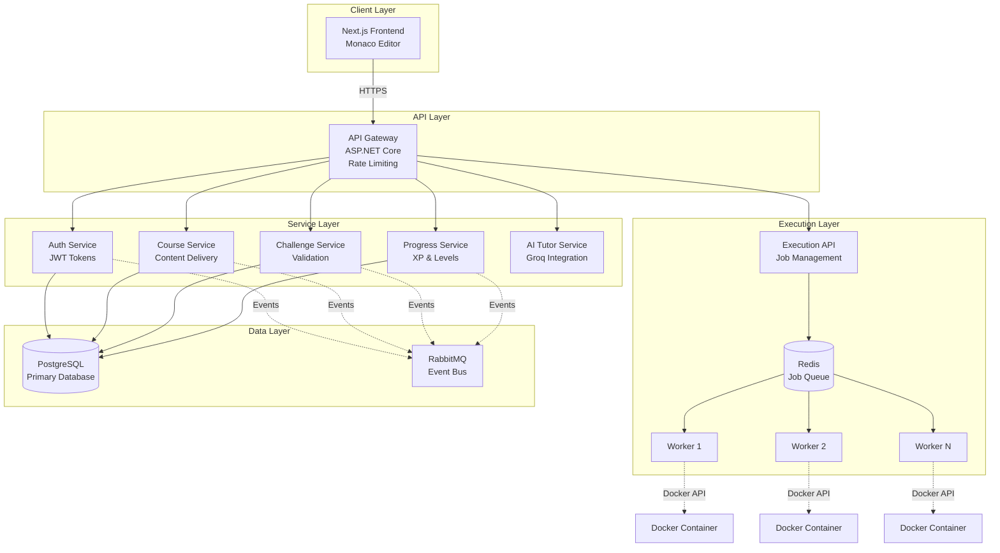
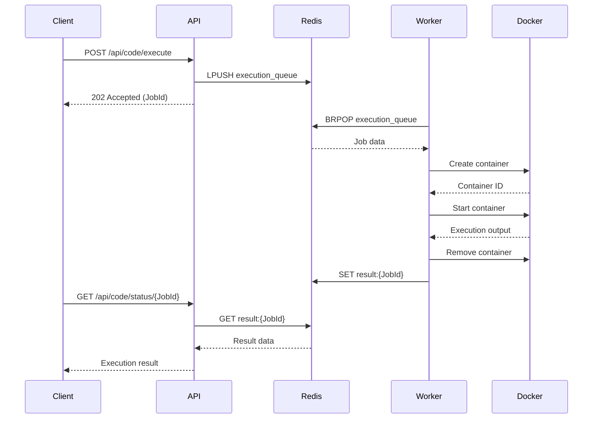
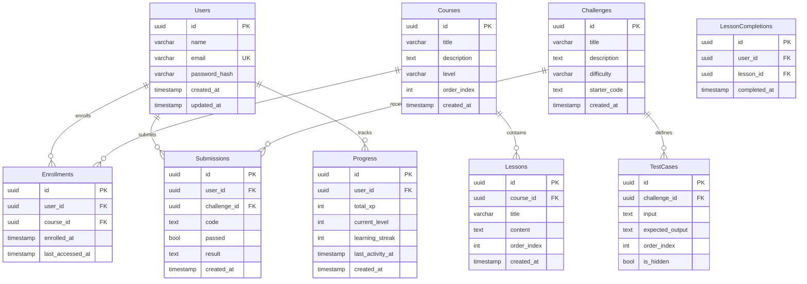

# Design Document: ASP.NET Core Learning Platform

## Overview

The ASP.NET Core Learning Platform is a distributed, microservices-based educational system that enables interactive learning through browser-based coding, secure code execution, and AI-powered feedback. The platform combines traditional course content delivery with hands-on coding challenges and guided projects, all wrapped in a gamified experience.

### Key Design Principles

1. **Security First**: All user code executes in isolated Docker containers with strict resource limits and no network access
2. **Scalability**: Microservices architecture with message queues enables horizontal scaling of code execution workers
3. **Separation of Concerns**: Clear boundaries between frontend, API gateway, domain services, and execution infrastructure
4. **Asynchronous Processing**: Code execution and AI feedback use job queues to handle load spikes and provide resilience
5. **Data Integrity**: Transactional operations with retry logic ensure student progress is never lost

## Architecture

### System Architecture Diagram



### Architectural Patterns

**Microservices Architecture**: Each domain service (Auth, Course, Challenge, Progress, AI Tutor) is independently deployable with its own database schema and API contract.

**API Gateway Pattern**: Single entry point for all client requests, handling authentication, rate limiting, and routing to appropriate services.

**Job Queue Pattern**: Code execution requests are queued in Redis, allowing workers to process jobs asynchronously and enabling horizontal scaling.

**Event-Driven Communication**: Services publish domain events to RabbitMQ for loose coupling (e.g., ChallengeCompleted event triggers XP award in Progress Service).

**Repository Pattern**: Each service uses repositories to abstract data access, enabling testability and database independence.

## Components and Interfaces

### Frontend Components

#### Browser IDE Component
- **Technology**: Monaco Editor (VS Code's editor)
- **Responsibilities**: 
  - Syntax highlighting for C#
  - IntelliSense autocomplete
  - Multi-file editing
  - Real-time syntax error display
  - Terminal output rendering
- **State Management**: React Context for editor state, code files, and execution results
- **API Integration**: WebSocket connection for real-time execution feedback

#### Dashboard Component
- **Responsibilities**:
  - Display XP, level, and progress metrics
  - Show course enrollment and completion status
  - Render learning streak calendar
  - Display solved challenges by difficulty
- **Data Fetching**: Server-side rendering with Next.js for initial load, client-side updates via REST API

#### Challenge Browser Component
- **Responsibilities**:
  - List challenges with filtering by difficulty
  - Display challenge details and test cases
  - Show submission history
  - Render test results with pass/fail indicators

### API Gateway

**Technology**: ASP.NET Core with YARP (Yet Another Reverse Proxy)

**Endpoints**:
```
POST   /api/auth/register
POST   /api/auth/login
GET    /api/courses
GET    /api/courses/{id}/lessons
GET    /api/challenges
POST   /api/challenges/{id}/submit
POST   /api/code/execute
POST   /api/code/review
GET    /api/progress/dashboard
GET    /api/leaderboard
```

**Middleware Pipeline**:
1. Exception handling middleware
2. Authentication middleware (JWT validation)
3. Rate limiting middleware (100 req/min per user)
4. Request logging middleware
5. Routing middleware

**Rate Limiting Strategy**:
- Token bucket algorithm
- Per-user limits stored in Redis
- 100 requests per minute per authenticated user
- 10 requests per minute for unauthenticated users

### Auth Service

**Responsibilities**:
- User registration with password hashing (BCrypt with salt)
- User authentication with JWT token issuance
- Token validation and refresh
- Session management

**API Contract**:
```csharp
// POST /api/auth/register
public record RegisterRequest(string Name, string Email, string Password);
public record RegisterResponse(Guid UserId, string Token);

// POST /api/auth/login
public record LoginRequest(string Email, string Password);
public record LoginResponse(Guid UserId, string Name, string Token, DateTime ExpiresAt);
```

**Security Implementation**:
- Passwords hashed with BCrypt (work factor: 12)
- JWT tokens with 24-hour expiration
- Refresh tokens stored in database with 30-day expiration
- Token signing with RS256 algorithm

### Course Service

**Responsibilities**:
- Course and lesson CRUD operations
- Content parsing and validation
- Enrollment tracking
- Lesson completion tracking

**API Contract**:
```csharp
// GET /api/courses
public record CourseListResponse(List<CourseSummary> Courses);
public record CourseSummary(Guid Id, string Title, string Description, Level Level, int LessonCount);

// GET /api/courses/{id}/lessons
public record LessonListResponse(List<LessonDetail> Lessons);
public record LessonDetail(Guid Id, string Title, string Content, int Order, bool IsCompleted);

// POST /api/courses/{courseId}/lessons/{lessonId}/complete
public record CompleteLessonRequest(Guid UserId);
public record CompleteLessonResponse(bool Success, Guid? NextLessonId);
```

**Content Parser**:
- Parses lesson content from markdown with embedded code blocks
- Validates content structure (title, description, code examples)
- Extracts metadata (difficulty, estimated time, prerequisites)

### Challenge Service

**Responsibilities**:
- Challenge CRUD operations
- Test case management
- Submission processing and validation
- Solution verification

**API Contract**:
```csharp
// GET /api/challenges
public record ChallengeListResponse(List<ChallengeSummary> Challenges);
public record ChallengeSummary(Guid Id, string Title, Difficulty Difficulty, bool IsSolved, int SubmissionCount);

// GET /api/challenges/{id}
public record ChallengeDetailResponse(
    Guid Id, 
    string Title, 
    string Description, 
    Difficulty Difficulty,
    string StarterCode,
    List<TestCasePreview> TestCases
);

// POST /api/challenges/{id}/submit
public record SubmitSolutionRequest(Guid UserId, string Code);
public record SubmitSolutionResponse(
    Guid SubmissionId,
    bool AllTestsPassed,
    List<TestResult> Results,
    int XpAwarded
);
```

**Test Case Execution**:
- Each test case runs in isolated scope
- Captures stdout, stderr, and return values
- Compares actual vs expected with deep equality
- Timeout per test case: 5 seconds

### Progress Service

**Responsibilities**:
- XP calculation and level management
- Learning streak tracking
- Achievement system
- Leaderboard generation

**API Contract**:
```csharp
// GET /api/progress/dashboard
public record DashboardResponse(
    int CurrentXP,
    int CurrentLevel,
    int XPToNextLevel,
    int SolvedChallenges,
    int CompletedProjects,
    int LearningStreak,
    List<CourseProgress> CoursesInProgress
);

// GET /api/leaderboard
public record LeaderboardResponse(List<LeaderboardEntry> Entries);
public record LeaderboardEntry(int Rank, string Name, int XP, int Level);
```

**XP Calculation**:
- Easy challenge: 10 XP
- Medium challenge: 25 XP
- Hard challenge: 50 XP
- Project completion: 100 XP
- Level formula: `Level = floor(sqrt(TotalXP / 100))`

**Streak Calculation**:
- Activity counts if user completes any challenge or lesson
- Streak breaks if no activity for 24+ hours
- Timezone-aware calculation based on user's local time

### Code Execution Service

**Responsibilities**:
- Job queue management
- Worker coordination
- Container lifecycle management
- Resource limit enforcement

**Architecture**:


**API Contract**:
```csharp
// POST /api/code/execute
public record ExecuteCodeRequest(string Code, List<string> Files, string EntryPoint);
public record ExecuteCodeResponse(Guid JobId, string Status);

// GET /api/code/status/{jobId}
public record ExecutionStatusResponse(
    Guid JobId,
    ExecutionStatus Status,
    string? Output,
    string? Error,
    int? ExitCode,
    long ExecutionTimeMs
);

public enum ExecutionStatus { Queued, Running, Completed, Failed, Timeout, MemoryExceeded }
```

**Worker Implementation**:
- Polls Redis queue with BRPOP (blocking pop)
- Creates Docker container with resource limits
- Mounts code files as read-only volume
- Executes `dotnet run` with timeout
- Captures stdout/stderr streams
- Cleans up container after execution
- Stores result in Redis with 5-minute TTL

**Container Configuration**:
```dockerfile
FROM mcr.microsoft.com/dotnet/sdk:8.0-alpine
WORKDIR /app
COPY . .
RUN dotnet restore
CMD ["dotnet", "run"]
```

**Resource Limits** (Docker run parameters):
- Memory: `--memory=512m --memory-swap=512m`
- CPU: `--cpus=1.0`
- PIDs: `--pids-limit=50`
- Network: `--network=none`
- Time: Enforced by worker timeout (30s)

### AI Tutor Service

**Responsibilities**:
- Code analysis via Groq API
- Feedback generation
- Best practice evaluation
- Security vulnerability detection

**API Contract**:
```csharp
// POST /api/code/review
public record CodeReviewRequest(string Code, string Context);
public record CodeReviewResponse(
    List<Feedback> Suggestions,
    int OverallScore,
    List<string> SecurityIssues,
    List<string> PerformanceIssues
);

public record Feedback(
    FeedbackType Type,
    string Message,
    int LineNumber,
    string CodeExample
);

public enum FeedbackType { Security, Performance, BestPractice, Architecture }
```

**Groq Integration**:
- Model: `llama-3.1-70b-versatile`
- System prompt includes ASP.NET Core best practices, SOLID principles, and security guidelines
- Temperature: 0.3 (more deterministic)
- Max tokens: 2000
- Timeout: 10 seconds

**Analysis Criteria**:
1. SOLID principles (Single Responsibility, Open/Closed, Liskov Substitution, Interface Segregation, Dependency Inversion)
2. Clean Architecture (separation of concerns, dependency rule)
3. Security (SQL injection, XSS, authentication issues, sensitive data exposure)
4. Performance (N+1 queries, inefficient algorithms, memory leaks)
5. ASP.NET Core conventions (async/await, dependency injection, configuration)

## Data Models

### Database Schema

**Technology**: PostgreSQL 15

**Schema Diagram**:


### Entity Models

**User Entity**:
```csharp
public class User
{
    public Guid Id { get; set; }
    public string Name { get; set; } = string.Empty;
    public string Email { get; set; } = string.Empty;
    public string PasswordHash { get; set; } = string.Empty;
    public DateTime CreatedAt { get; set; }
    public DateTime UpdatedAt { get; set; }
    
    // Navigation properties
    public Progress Progress { get; set; } = null!;
    public ICollection<Enrollment> Enrollments { get; set; } = new List<Enrollment>();
    public ICollection<Submission> Submissions { get; set; } = new List<Submission>();
}
```

**Course Entity**:
```csharp
public class Course
{
    public Guid Id { get; set; }
    public string Title { get; set; } = string.Empty;
    public string Description { get; set; } = string.Empty;
    public Level Level { get; set; }
    public int OrderIndex { get; set; }
    public DateTime CreatedAt { get; set; }
    
    // Navigation properties
    public ICollection<Lesson> Lessons { get; set; } = new List<Lesson>();
    public ICollection<Enrollment> Enrollments { get; set; } = new List<Enrollment>();
}

public enum Level { Beginner, Intermediate, Advanced }
```

**Challenge Entity**:
```csharp
public class Challenge
{
    public Guid Id { get; set; }
    public string Title { get; set; } = string.Empty;
    public string Description { get; set; } = string.Empty;
    public Difficulty Difficulty { get; set; }
    public string StarterCode { get; set; } = string.Empty;
    public DateTime CreatedAt { get; set; }
    
    // Navigation properties
    public ICollection<TestCase> TestCases { get; set; } = new List<TestCase>();
    public ICollection<Submission> Submissions { get; set; } = new List<Submission>();
}

public enum Difficulty { Easy, Medium, Hard }
```

**Submission Entity**:
```csharp
public class Submission
{
    public Guid Id { get; set; }
    public Guid UserId { get; set; }
    public Guid ChallengeId { get; set; }
    public string Code { get; set; } = string.Empty;
    public bool Passed { get; set; }
    public string Result { get; set; } = string.Empty;
    public DateTime CreatedAt { get; set; }
    
    // Navigation properties
    public User User { get; set; } = null!;
    public Challenge Challenge { get; set; } = null!;
}
```

**Progress Entity**:
```csharp
public class Progress
{
    public Guid Id { get; set; }
    public Guid UserId { get; set; }
    public int TotalXP { get; set; }
    public int CurrentLevel { get; set; }
    public int LearningStreak { get; set; }
    public DateTime LastActivityAt { get; set; }
    public DateTime CreatedAt { get; set; }
    
    // Navigation property
    public User User { get; set; } = null!;
    
    // Computed property
    public int XPToNextLevel => ((CurrentLevel + 1) * (CurrentLevel + 1) * 100) - TotalXP;
}
```

### Domain Value Objects

**Content Value Object** (for lesson content parsing):
```csharp
public record Content(
    string Title,
    string Description,
    List<CodeBlock> CodeBlocks,
    List<string> KeyPoints
);

public record CodeBlock(
    string Language,
    string Code,
    string? Caption
);
```

**TestCase Value Object**:
```csharp
public record TestCase(
    string Input,
    string ExpectedOutput,
    bool IsHidden
);
```

**ExecutionResult Value Object**:
```csharp
public record ExecutionResult(
    bool Success,
    string Output,
    string Error,
    int ExitCode,
    long ExecutionTimeMs,
    long MemoryUsedBytes
);
```

### Repository Interfaces

```csharp
public interface IUserRepository
{
    Task<User?> GetByIdAsync(Guid id);
    Task<User?> GetByEmailAsync(string email);
    Task<User> CreateAsync(User user);
    Task UpdateAsync(User user);
}

public interface ICourseRepository
{
    Task<List<Course>> GetAllAsync();
    Task<Course?> GetByIdAsync(Guid id);
    Task<List<Lesson>> GetLessonsAsync(Guid courseId);
}

public interface IChallengeRepository
{
    Task<List<Challenge>> GetAllAsync();
    Task<Challenge?> GetByIdAsync(Guid id);
    Task<List<TestCase>> GetTestCasesAsync(Guid challengeId);
}

public interface ISubmissionRepository
{
    Task<Submission> CreateAsync(Submission submission);
    Task<List<Submission>> GetByUserAndChallengeAsync(Guid userId, Guid challengeId);
}

public interface IProgressRepository
{
    Task<Progress?> GetByUserIdAsync(Guid userId);
    Task UpdateAsync(Progress progress);
    Task<List<LeaderboardEntry>> GetTopAsync(int count);
}
```


## Correctness Properties

*A property is a characteristic or behavior that should hold true across all valid executions of a system—essentially, a formal statement about what the system should do. Properties serve as the bridge between human-readable specifications and machine-verifiable correctness guarantees.*

### Property 1: Password Hashing with Salt

*For any* valid password, storing it in the system should result in a hash that is not equal to the plaintext password, and hashing the same password twice should produce different hashes due to unique salts.

**Validates: Requirements 1.1, 1.4**

### Property 2: Authentication Round Trip

*For any* valid user registration, authenticating with the same credentials should succeed and return a valid session token.

**Validates: Requirements 1.2**

### Property 3: Invalid Credentials Rejection

*For any* invalid credentials (wrong password, non-existent email, malformed input), authentication attempts should be rejected with an appropriate error message.

**Validates: Requirements 1.3**

### Property 4: Token Validation

*For any* authenticated request, the API gateway should validate the session token before processing, accepting valid tokens and rejecting invalid or expired tokens.

**Validates: Requirements 1.5**

### Property 5: Multi-File Editor State

*For any* set of code files, the browser IDE should maintain separate content for each file and allow switching between them without data loss.

**Validates: Requirements 2.3**

### Property 6: Code Execution Enqueueing

*For any* code execution request, the platform should add a job to the queue with the submitted code and return a job identifier.

**Validates: Requirements 3.1, 12.2**

### Property 7: Job Processing

*For any* job in the queue, an available worker should dequeue it and process it, returning execution results.

**Validates: Requirements 3.2, 12.3**

### Property 8: Execution Isolation

*For any* two concurrent code execution requests, they should execute in separate containers without interfering with each other's output, variables, or state.

**Validates: Requirements 3.9**

### Property 9: AI Code Review Integration

*For any* code review request, the AI Tutor should call the Groq API with the submitted code and return structured feedback.

**Validates: Requirements 4.1**

### Property 10: AI Feedback Structure

*For any* AI code review response, the feedback should include specific code examples for each suggestion.

**Validates: Requirements 4.7**

### Property 11: Challenge Data Completeness

*For any* challenge stored in the platform, it should have all required fields: title, description, difficulty level, starter code, and at least one test case.

**Validates: Requirements 5.1**

### Property 12: Challenge Retrieval

*For any* challenge opened by a student, the API should return the complete description and starter code.

**Validates: Requirements 5.2**

### Property 13: Test Case Execution Completeness

*For any* challenge submission, all test cases associated with that challenge should be executed against the submitted code.

**Validates: Requirements 5.3, 13.2**

### Property 14: XP Award on Success

*For any* challenge submission where all test cases pass, the platform should mark the challenge as solved and award XP to the student based on difficulty.

**Validates: Requirements 5.4**

### Property 15: Test Failure Reporting

*For any* failed test case, the result should include the test case identifier, expected output, and actual output.

**Validates: Requirements 5.5, 13.6**

### Property 16: Challenge Difficulty Categorization

*For any* challenge in the system, its difficulty should be one of: Easy, Medium, or Hard.

**Validates: Requirements 5.6**

### Property 17: Submission Persistence

*For any* challenge submission, the platform should store a record with timestamp, submitted code, and result.

**Validates: Requirements 5.7**

### Property 18: Project Step Ordering

*For any* project in the system, its steps should have sequential order indices starting from 1.

**Validates: Requirements 6.1**

### Property 19: Project Start

*For any* project started by a student, the API should return the first step (order index 1) with instructions and starter code.

**Validates: Requirements 6.2**

### Property 20: Sequential Step Unlocking

*For any* project step completion, the next step should only be accessible after the current step is validated and marked complete.

**Validates: Requirements 6.3**

### Property 21: Project Step Examples

*For any* project step, it should include an example implementation.

**Validates: Requirements 6.4**

### Property 22: Project Completion XP

*For any* project where all steps are completed, the platform should mark the project as complete and award 100 XP.

**Validates: Requirements 6.5**

### Property 23: Course Structure

*For any* course in the system, it should have a defined difficulty level (Beginner, Intermediate, or Advanced) and contain at least one lesson.

**Validates: Requirements 7.1, 7.5**

### Property 24: Lesson Ordering

*For any* course, its lessons should have unique sequential order indices with no gaps.

**Validates: Requirements 7.2**

### Property 25: Enrollment Tracking

*For any* student enrollment in a course, the platform should create an enrollment record and track which lessons have been completed.

**Validates: Requirements 7.3**

### Property 26: Lesson Content Delivery

*For any* lesson opened by a student, the Course Service should return the complete lesson content.

**Validates: Requirements 7.4**

### Property 27: Lesson Completion Progression

*For any* lesson completion, the platform should mark it as complete and make the next lesson (by order index) accessible.

**Validates: Requirements 7.6**

### Property 28: Dashboard Data Completeness

*For any* dashboard request, the response should include current XP, level, solved challenge counts by difficulty, completed project count, and learning streak.

**Validates: Requirements 8.1, 8.2, 8.3, 8.4**

### Property 29: Course Progress Calculation

*For any* enrolled course, the completion percentage should equal (completed lessons / total lessons) * 100.

**Validates: Requirements 8.5**

### Property 30: Level Calculation

*For any* student's total XP, their level should equal floor(sqrt(TotalXP / 100)), and when XP reaches the next level threshold, the level should increment.

**Validates: Requirements 9.5**

### Property 31: Streak Calculation

*For any* sequence of student activities, the learning streak should equal the count of consecutive days with at least one activity (challenge solved or lesson completed).

**Validates: Requirements 9.6**

### Property 32: Leaderboard Ranking

*For any* set of students, the leaderboard should rank them in descending order by total XP, with the top 100 displayed.

**Validates: Requirements 9.7**

### Property 33: Entity Data Completeness

*For any* entity (User, Course, Lesson, Challenge, Submission) stored in the database, it should have all required fields populated with valid values.

**Validates: Requirements 10.1, 10.2, 10.3, 10.4, 10.5**

### Property 34: Database Retry Logic

*For any* transient database failure, the platform should retry the operation up to 3 times before returning an error to the user.

**Validates: Requirements 10.7**

### Property 35: API Gateway Routing

*For any* incoming request, the API Gateway should route it to the correct microservice based on the request path (courses → Course Service, code execution → Execution Engine, AI review → AI Tutor).

**Validates: Requirements 11.1, 11.2, 11.3**

### Property 36: Service Unavailability Handling

*For any* request to an unavailable microservice, the API Gateway should return a 503 Service Unavailable error.

**Validates: Requirements 11.4**

### Property 37: Rate Limiting

*For any* authenticated user making more than 100 requests in a 60-second window, subsequent requests should be rejected with a 429 Too Many Requests error.

**Validates: Requirements 11.5**

### Property 38: Job Timeout Handling

*For any* job that remains in the queue for more than 60 seconds, the platform should mark it as failed and notify the student.

**Validates: Requirements 12.4**

### Property 39: Concurrent Worker Processing

*For any* set of jobs in the queue, multiple workers should be able to process them concurrently without conflicts.

**Validates: Requirements 12.5**

### Property 40: Job Retry on Worker Failure

*For any* job where the worker fails during processing, the platform should requeue the job for another worker to retry.

**Validates: Requirements 12.6**

### Property 41: Test Case Parsing

*For any* valid test case definition, the platform should parse it into a TestCase object with input and expected output.

**Validates: Requirements 13.1**

### Property 42: Output Comparison

*For any* test case execution, the platform should compare the actual output with the expected output using deep equality.

**Validates: Requirements 13.3**

### Property 43: Test Case Input Support

*For any* test case, it should support input parameters and expected return values.

**Validates: Requirements 13.4**

### Property 44: All Tests Pass Result

*For any* submission where all test cases pass, the platform should return a success result.

**Validates: Requirements 13.5**

### Property 45: Prohibited Code Detection

*For any* submitted code containing prohibited system calls (file I/O, network access, process spawning), the platform should detect and reject it before execution.

**Validates: Requirements 14.4, 14.5**

### Property 46: Container Cleanup

*For any* code execution, the container should be destroyed immediately after execution completes or times out.

**Validates: Requirements 14.6**

### Property 47: Compilation Error Formatting

*For any* compilation error, the error message should include the line number where the error occurred.

**Validates: Requirements 16.1**

### Property 48: Runtime Error Formatting

*For any* runtime exception, the error message should include the exception message and stack trace.

**Validates: Requirements 16.2**

### Property 49: Network Error Handling

*For any* network error, the platform should return a user-friendly error message (not raw exception details).

**Validates: Requirements 16.3**

### Property 50: Timeout Error Messaging

*For any* execution timeout, the error message should clearly indicate that execution exceeded time limits.

**Validates: Requirements 16.4**

### Property 51: Error Logging

*For any* error that occurs in the platform, it should be logged to the centralized logging system with timestamp, context, and stack trace.

**Validates: Requirements 16.5**

### Property 52: Content Parsing

*For any* valid lesson content string, parsing it should produce a Content object with title, description, code blocks, and key points.

**Validates: Requirements 17.1**

### Property 53: Invalid Content Error

*For any* invalid lesson content format, the parser should return a descriptive error indicating what is invalid.

**Validates: Requirements 17.2**

### Property 54: Content Round Trip

*For any* valid Content object, parsing then printing then parsing should produce an equivalent Content object (parse(print(parse(x))) == parse(x)).

**Validates: Requirements 17.3, 17.4**

### Property 55: TestCase Parsing

*For any* valid test case data string, parsing it should produce a TestCase object with input, expected output, and visibility flag.

**Validates: Requirements 18.1**

### Property 56: Invalid TestCase Error

*For any* invalid test case format, the parser should return a descriptive error indicating which field is invalid.

**Validates: Requirements 18.2**

### Property 57: TestCase Round Trip

*For any* valid TestCase object, parsing then printing then parsing should produce an equivalent TestCase object (parse(print(parse(x))) == parse(x)).

**Validates: Requirements 18.3, 18.4**


## Error Handling

### Error Categories

**1. Validation Errors** (400 Bad Request)
- Invalid input format (malformed JSON, missing required fields)
- Business rule violations (empty password, invalid email format)
- Constraint violations (duplicate email, invalid difficulty level)

**2. Authentication Errors** (401 Unauthorized)
- Invalid credentials
- Expired or malformed JWT token
- Missing authentication header

**3. Authorization Errors** (403 Forbidden)
- Attempting to access another user's data
- Insufficient permissions for operation

**4. Resource Not Found** (404 Not Found)
- Challenge, course, lesson, or user not found
- Invalid resource identifier

**5. Rate Limiting** (429 Too Many Requests)
- Exceeded request rate limit
- Response includes Retry-After header

**6. Execution Errors** (422 Unprocessable Entity)
- Compilation errors in submitted code
- Runtime exceptions during execution
- Test case failures

**7. Service Errors** (500 Internal Server Error)
- Database connection failures
- Unexpected exceptions
- Worker crashes

**8. Service Unavailable** (503 Service Unavailable)
- Microservice is down
- Database is unreachable
- Queue is full

### Error Response Format

All errors follow a consistent JSON structure:

```json
{
  "error": {
    "code": "VALIDATION_ERROR",
    "message": "Invalid input provided",
    "details": [
      {
        "field": "email",
        "message": "Email format is invalid"
      }
    ],
    "timestamp": "2024-01-15T10:30:00Z",
    "traceId": "abc123-def456-ghi789"
  }
}
```

### Error Handling Strategies

**Retry Logic**:
- Database operations: 3 retries with exponential backoff (100ms, 200ms, 400ms)
- External API calls (Groq): 2 retries with 1-second delay
- Queue operations: 3 retries with linear backoff

**Circuit Breaker**:
- Applied to microservice calls
- Opens after 5 consecutive failures
- Half-open state after 30 seconds
- Closes after 3 successful requests

**Graceful Degradation**:
- If AI Tutor is unavailable, return basic syntax checking only
- If leaderboard service fails, show cached rankings
- If execution queue is full, return estimated wait time

**Logging and Monitoring**:
- All errors logged to centralized system (e.g., Serilog with Seq or ELK stack)
- Error logs include: timestamp, user ID, request ID, stack trace, context
- Critical errors trigger alerts (PagerDuty, Slack)
- Metrics tracked: error rate, error types, response times

### Specific Error Scenarios

**Code Execution Errors**:
```csharp
// Compilation error
{
  "error": {
    "code": "COMPILATION_ERROR",
    "message": "Code failed to compile",
    "details": [
      {
        "line": 15,
        "message": "CS0103: The name 'variableName' does not exist in the current context"
      }
    ]
  }
}

// Runtime error
{
  "error": {
    "code": "RUNTIME_ERROR",
    "message": "Code execution failed",
    "details": {
      "exception": "System.NullReferenceException",
      "message": "Object reference not set to an instance of an object",
      "stackTrace": "at Program.Main() in Program.cs:line 10"
    }
  }
}

// Timeout error
{
  "error": {
    "code": "EXECUTION_TIMEOUT",
    "message": "Code execution exceeded 30 second time limit"
  }
}

// Memory error
{
  "error": {
    "code": "MEMORY_EXCEEDED",
    "message": "Code execution exceeded 512MB memory limit"
  }
}
```

**Security Errors**:
```csharp
// Prohibited code detected
{
  "error": {
    "code": "PROHIBITED_CODE",
    "message": "Code contains prohibited operations",
    "details": [
      {
        "line": 8,
        "operation": "System.IO.File.ReadAllText",
        "reason": "File system access is not allowed"
      }
    ]
  }
}
```

## Testing Strategy

### Overview

The testing strategy employs a dual approach combining traditional unit/integration tests with property-based testing to ensure comprehensive coverage and correctness guarantees.

### Unit Testing

**Framework**: xUnit for .NET services, Jest for Next.js frontend

**Coverage Targets**:
- Minimum 80% code coverage for business logic
- 100% coverage for critical paths (authentication, XP calculation, test execution)

**Test Organization**:
```
tests/
├── Unit/
│   ├── Auth/
│   │   ├── PasswordHashingTests.cs
│   │   ├── JwtTokenTests.cs
│   │   └── AuthServiceTests.cs
│   ├── Courses/
│   │   ├── CourseServiceTests.cs
│   │   └── ContentParserTests.cs
│   ├── Challenges/
│   │   ├── ChallengeServiceTests.cs
│   │   ├── TestCaseParserTests.cs
│   │   └── SubmissionValidatorTests.cs
│   ├── Progress/
│   │   ├── XPCalculatorTests.cs
│   │   ├── LevelCalculatorTests.cs
│   │   └── StreakCalculatorTests.cs
│   └── Execution/
│       ├── JobQueueTests.cs
│       ├── WorkerTests.cs
│       └── ContainerManagerTests.cs
├── Integration/
│   ├── ApiGatewayTests.cs
│   ├── DatabaseTests.cs
│   └── EndToEndTests.cs
└── Property/
    ├── AuthPropertiesTests.cs
    ├── ChallengePropertiesTests.cs
    ├── ProgressPropertiesTests.cs
    └── ParserPropertiesTests.cs
```

**Example Unit Tests**:
```csharp
// Specific example tests for XP awards
[Fact]
public void SolvingEasyChallenge_Awards10XP()
{
    var challenge = new Challenge { Difficulty = Difficulty.Easy };
    var xp = XPCalculator.CalculateXP(challenge);
    Assert.Equal(10, xp);
}

[Fact]
public void SolvingMediumChallenge_Awards25XP()
{
    var challenge = new Challenge { Difficulty = Difficulty.Medium };
    var xp = XPCalculator.CalculateXP(challenge);
    Assert.Equal(25, xp);
}

// Edge case tests
[Fact]
public void EmptyTestCaseList_ThrowsValidationException()
{
    var challenge = new Challenge { TestCases = new List<TestCase>() };
    Assert.Throws<ValidationException>(() => challenge.Validate());
}

[Fact]
public void NullStarterCode_ThrowsValidationException()
{
    var challenge = new Challenge { StarterCode = null };
    Assert.Throws<ValidationException>(() => challenge.Validate());
}
```

### Property-Based Testing

**Framework**: FsCheck for .NET (integrates with xUnit)

**Configuration**:
- Minimum 100 iterations per property test
- Custom generators for domain objects (User, Challenge, Course, etc.)
- Shrinking enabled to find minimal failing cases

**Generator Examples**:
```csharp
// Generator for valid user data
public static Arbitrary<User> ValidUser() =>
    Arb.From(
        from name in Arb.Generate<NonEmptyString>()
        from email in Arb.Generate<EmailAddress>()
        from password in Arb.Generate<Password>()
        select new User
        {
            Id = Guid.NewGuid(),
            Name = name.Get,
            Email = email.Value,
            PasswordHash = BCrypt.HashPassword(password.Value),
            CreatedAt = DateTime.UtcNow
        }
    );

// Generator for challenges with valid test cases
public static Arbitrary<Challenge> ValidChallenge() =>
    Arb.From(
        from title in Arb.Generate<NonEmptyString>()
        from difficulty in Gen.Elements(Difficulty.Easy, Difficulty.Medium, Difficulty.Hard)
        from testCases in Gen.NonEmptyListOf(ValidTestCase().Generator)
        select new Challenge
        {
            Id = Guid.NewGuid(),
            Title = title.Get,
            Difficulty = difficulty,
            TestCases = testCases.ToList()
        }
    );
```

**Property Test Examples**:
```csharp
// Feature: aspnet-learning-platform, Property 1: Password Hashing with Salt
[Property(MaxTest = 100)]
public Property PasswordHashing_ProducesDifferentHashesForSamePassword()
{
    return Prop.ForAll<NonEmptyString>(password =>
    {
        var hash1 = BCrypt.HashPassword(password.Get);
        var hash2 = BCrypt.HashPassword(password.Get);
        
        return hash1 != password.Get && 
               hash2 != password.Get && 
               hash1 != hash2;
    });
}

// Feature: aspnet-learning-platform, Property 2: Authentication Round Trip
[Property(MaxTest = 100)]
public Property AuthenticationRoundTrip_SucceedsForValidUser()
{
    return Prop.ForAll(ValidUser(), user =>
    {
        var authService = new AuthService();
        var registerResult = authService.Register(user.Name, user.Email, "password123");
        var loginResult = authService.Login(user.Email, "password123");
        
        return registerResult.Success && 
               loginResult.Success && 
               !string.IsNullOrEmpty(loginResult.Token);
    });
}

// Feature: aspnet-learning-platform, Property 30: Level Calculation
[Property(MaxTest = 100)]
public Property LevelCalculation_FollowsFormula()
{
    return Prop.ForAll<PositiveInt>(xp =>
    {
        var level = LevelCalculator.CalculateLevel(xp.Get);
        var expectedLevel = (int)Math.Floor(Math.Sqrt(xp.Get / 100.0));
        
        return level == expectedLevel;
    });
}

// Feature: aspnet-learning-platform, Property 54: Content Round Trip
[Property(MaxTest = 100)]
public Property ContentRoundTrip_PreservesStructure()
{
    return Prop.ForAll(ValidContent(), content =>
    {
        var printed = ContentPrinter.Print(content);
        var parsed = ContentParser.Parse(printed);
        var reparsed = ContentParser.Parse(ContentPrinter.Print(parsed));
        
        return parsed.Equals(reparsed);
    });
}

// Feature: aspnet-learning-platform, Property 57: TestCase Round Trip
[Property(MaxTest = 100)]
public Property TestCaseRoundTrip_PreservesStructure()
{
    return Prop.ForAll(ValidTestCase(), testCase =>
    {
        var printed = TestCasePrinter.Print(testCase);
        var parsed = TestCaseParser.Parse(printed);
        var reparsed = TestCaseParser.Parse(TestCasePrinter.Print(parsed));
        
        return parsed.Equals(reparsed);
    });
}

// Feature: aspnet-learning-platform, Property 8: Execution Isolation
[Property(MaxTest = 100)]
public Property ExecutionIsolation_PreventsCrossTalk()
{
    return Prop.ForAll<NonEmptyString, NonEmptyString>((code1, code2) =>
    {
        var job1 = new ExecutionJob { Code = code1.Get };
        var job2 = new ExecutionJob { Code = code2.Get };
        
        var result1Task = executionEngine.ExecuteAsync(job1);
        var result2Task = executionEngine.ExecuteAsync(job2);
        
        Task.WaitAll(result1Task, result2Task);
        
        var result1 = result1Task.Result;
        var result2 = result2Task.Result;
        
        // Results should be independent
        return result1.ContainerId != result2.ContainerId &&
               result1.JobId != result2.JobId;
    });
}
```

### Integration Testing

**Scope**: Test interactions between services, database, and queue

**Test Scenarios**:
1. End-to-end challenge submission flow
2. Course enrollment and progress tracking
3. Code execution with queue and workers
4. AI feedback integration
5. Leaderboard updates after XP changes

**Example Integration Test**:
```csharp
[Fact]
public async Task ChallengeSubmission_EndToEnd_AwardsXPAndUpdatesLeaderboard()
{
    // Arrange
    var user = await CreateTestUser();
    var challenge = await CreateTestChallenge(Difficulty.Medium);
    var correctSolution = challenge.GetCorrectSolution();
    
    // Act
    var submissionResult = await challengeService.SubmitAsync(
        user.Id, 
        challenge.Id, 
        correctSolution
    );
    
    // Assert
    Assert.True(submissionResult.AllTestsPassed);
    Assert.Equal(25, submissionResult.XpAwarded);
    
    var progress = await progressService.GetProgressAsync(user.Id);
    Assert.Equal(25, progress.TotalXP);
    
    var leaderboard = await progressService.GetLeaderboardAsync();
    Assert.Contains(leaderboard, entry => entry.UserId == user.Id);
}
```

### Performance Testing

**Tools**: BenchmarkDotNet for .NET, k6 for load testing

**Benchmarks**:
- Code execution latency: < 5 seconds (p95)
- API response time: < 200ms (p95)
- Database query time: < 50ms (p95)
- Queue throughput: > 100 jobs/second

**Load Testing Scenarios**:
- 1000 concurrent users browsing challenges
- 100 concurrent code executions
- 50 concurrent AI feedback requests

### Security Testing

**Automated Scans**:
- OWASP dependency check for vulnerable packages
- Static analysis with SonarQube
- Container scanning with Trivy

**Manual Testing**:
- Penetration testing for authentication bypass
- Code injection attempts in execution engine
- Rate limiting validation
- JWT token manipulation

### Test Data Management

**Fixtures**:
- Seed data for courses, lessons, and challenges
- Test users with various progress states
- Sample code submissions (passing and failing)

**Database Strategy**:
- Use in-memory database (SQLite) for unit tests
- Use Docker container with PostgreSQL for integration tests
- Reset database state between tests

### Continuous Integration

**Pipeline**:
1. Run unit tests (parallel execution)
2. Run property tests (100 iterations each)
3. Run integration tests (sequential)
4. Generate coverage report
5. Run static analysis
6. Build Docker images
7. Deploy to staging environment
8. Run smoke tests

**Quality Gates**:
- All tests must pass
- Code coverage ≥ 80%
- No critical security vulnerabilities
- No code smells (SonarQube)

