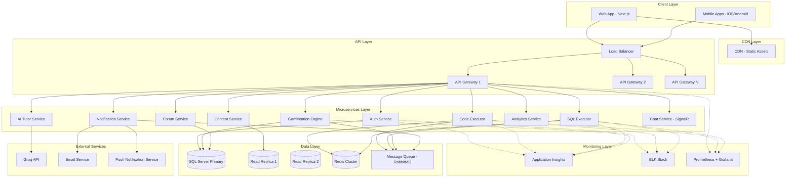
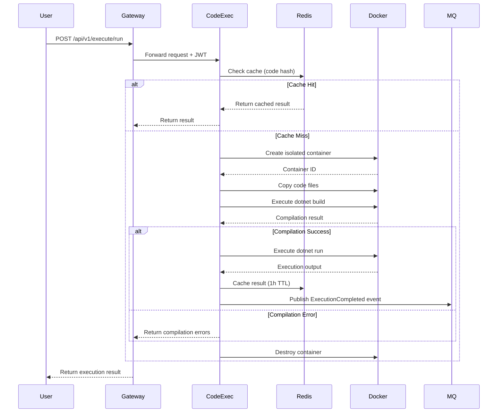
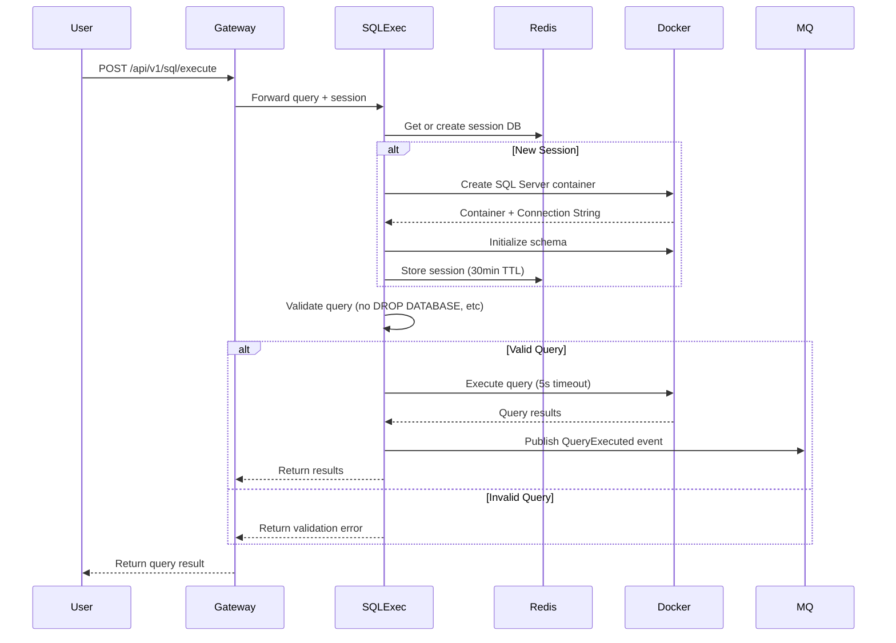
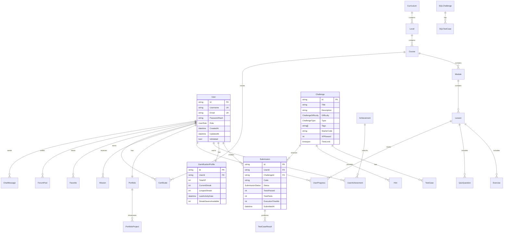
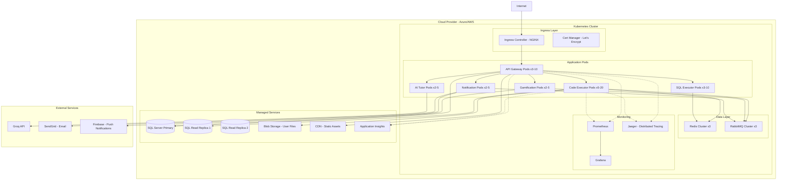

# Design Document: Platform Evolution SaaS

## Overview

Este documento apresenta o design técnico completo para a transformação da plataforma educacional ASP.NET existente em um produto SaaS de nível mundial. A evolução abrange migração de banco de dados, arquitetura de microservices, IDE completa no navegador, executor de código e SQL em containers isolados, sistema de gamificação avançado, IA tutor integrada, e infraestrutura escalável capaz de suportar 10.000 usuários simultâneos.

### Objetivos do Design

1. **Escalabilidade**: Arquitetura de microservices com auto-scaling para suportar crescimento exponencial
2. **Segurança**: Execução isolada de código em containers Docker com validação rigorosa
3. **Performance**: Resposta de API em <200ms (p95) com cache distribuído Redis
4. **Experiência do Usuário**: IDE completa no navegador com Monaco Editor, debugger visual e IntelliSense
5. **Engajamento**: Sistema de gamificação completo com XP, streaks, rankings, achievements e badges
6. **Inteligência Artificial**: Integração com Groq API para tutoria, análise de código e sugestões de refatoração
7. **Observabilidade**: Telemetria completa com Application Insights, ELK stack e distributed tracing

### Escopo do Sistema

A plataforma será composta por 9 microservices independentes orquestrados via Kubernetes:

- **API Gateway**: Ponto de entrada único com autenticação JWT e rate limiting
- **Code Executor Service**: Compilação e execução de código C# em containers isolados
- **SQL Executor Service**: Execução de queries SQL em bancos temporários isolados
- **Gamification Engine**: Gerenciamento de XP, níveis, streaks, achievements e rankings
- **AI Tutor Service**: Integração com Groq para feedback inteligente e mentoria
- **Notification Service**: Notificações in-app, email e push
- **Analytics Service**: Processamento de métricas e geração de insights
- **Cache Service**: Cache distribuído com Redis
- **Telemetry Service**: Coleta e agregação de telemetria

### Tecnologias Principais

- **Backend**: ASP.NET Core 8.0, C# 12, Entity Framework Core 8
- **Banco de Dados**: SQL Server 2022 com read replicas
- **Cache**: Redis 7.x com clustering
- **Containers**: Docker, Kubernetes (AKS ou EKS)
- **Frontend**: Next.js 14, React 18, TypeScript, Monaco Editor
- **Real-time**: SignalR para chat e colaboração
- **IA**: Groq API (Llama 3.1 70B)
- **Message Queue**: RabbitMQ ou Azure Service Bus
- **Monitoramento**: Application Insights, ELK Stack, Prometheus, Grafana
- **CI/CD**: GitHub Actions, ArgoCD
- **CDN**: Azure CDN ou CloudFront


## Architecture

### High-Level Architecture

A arquitetura segue o padrão de microservices com separação clara de responsabilidades, comunicação assíncrona via message queue e cache distribuído para otimização de performance.



### Microservices Architecture Details

#### 1. API Gateway

**Responsabilidades**:
- Roteamento de requisições para microservices apropriados
- Autenticação JWT e validação de tokens
- Rate limiting (100 req/min por usuário, 1000 req/min por IP)
- Request/Response logging
- CORS handling
- API versioning (v1, v2)

**Tecnologias**: Ocelot ou YARP (Yet Another Reverse Proxy)

**Endpoints**:
- `/api/v1/auth/*` → Auth Service
- `/api/v1/content/*` → Content Service
- `/api/v1/execute/*` → Code Executor
- `/api/v1/sql/*` → SQL Executor
- `/api/v1/gamification/*` → Gamification Engine
- `/api/v1/ai/*` → AI Tutor Service
- `/api/v1/notifications/*` → Notification Service
- `/api/v1/analytics/*` → Analytics Service
- `/api/v1/forum/*` → Forum Service
- `/api/v1/chat/*` → Chat Service


#### 2. Code Executor Service

**Responsabilidades**:
- Compilação de código C# em containers isolados
- Execução de Console Apps, Web APIs, MVC e Minimal APIs
- Validação de test cases e cálculo de code coverage
- Gerenciamento de pool de containers Docker
- Timeout e resource limiting (512MB RAM, 1 CPU core, 60s execution)
- Cache de resultados de compilação

**Tecnologias**: ASP.NET Core, Docker SDK, Roslyn Compiler API

**Fluxo de Execução**:


**Container Pool Management**:
- Warm pool: 10 containers pré-inicializados
- Max pool: 100 containers simultâneos
- Auto-scaling baseado em queue length
- Container reuse para mesma sessão de usuário (5 min TTL)


#### 3. SQL Executor Service

**Responsabilidades**:
- Criação de bancos temporários isolados por sessão
- Execução de queries SQL com timeout (5s)
- Validação de SQL challenges contra expected results
- Prevenção de operações destrutivas em system databases
- Limpeza automática de bancos temporários (30 min inatividade)
- Auditoria de todas as queries executadas

**Tecnologias**: ASP.NET Core, SQL Server, Docker

**Fluxo de Execução**:


**Security Measures**:
- Whitelist de comandos permitidos (SELECT, INSERT, UPDATE, DELETE, CREATE TABLE, ALTER TABLE)
- Blacklist de comandos proibidos (DROP DATABASE, SHUTDOWN, xp_cmdshell)
- Row limit: 1000 rows máximo
- Query timeout: 5 segundos
- Network isolation: containers sem acesso externo


#### 4. Gamification Engine

**Responsabilidades**:
- Cálculo e atribuição de XP por atividades
- Gerenciamento de níveis (Level = floor(sqrt(TotalXP / 100)))
- Tracking de streaks diários com timezone do usuário
- Gerenciamento de achievements e badges
- Atualização de rankings globais, semanais e mensais
- Processamento de missões diárias e semanais
- Distribuição de recompensas e bônus

**Tecnologias**: ASP.NET Core, Redis (leaderboards), SQL Server

**XP Calculation Algorithm**:
```csharp
public class XPCalculator
{
    private readonly Dictionary<ActivityType, int> _baseXP = new()
    {
        { ActivityType.LessonCompleted, 5 },
        { ActivityType.EasyChallenge, 10 },
        { ActivityType.MediumChallenge, 25 },
        { ActivityType.HardChallenge, 50 },
        { ActivityType.ProjectCompleted, 100 },
        { ActivityType.HelpfulForumPost, 10 },
        { ActivityType.DailyMissionCompleted, 50 },
        { ActivityType.WeeklyMissionCompleted, 200 }
    };
    
    public int CalculateXP(ActivityType activity, UserContext user)
    {
        int baseXP = _baseXP[activity];
        
        // Apply streak multiplier
        decimal multiplier = user.CurrentStreak switch
        {
            >= 100 => 1.5m,
            >= 30 => 1.2m,
            >= 7 => 1.1m,
            _ => 1.0m
        };
        
        // Apply time attack bonus
        if (activity == ActivityType.TimeAttackCompleted)
        {
            baseXP += user.RemainingTime switch
            {
                >= 600 => 50, // 10+ minutes
                >= 300 => 30, // 5+ minutes
                _ => 10
            };
        }
        
        return (int)(baseXP * multiplier);
    }
    
    public int CalculateLevel(int totalXP)
    {
        return (int)Math.Floor(Math.Sqrt(totalXP / 100.0));
    }
}
```

**Leaderboard Implementation** (Redis Sorted Sets):
```csharp
public class LeaderboardService
{
    private readonly IConnectionMultiplexer _redis;
    
    public async Task UpdateUserRank(string userId, int totalXP)
    {
        var db = _redis.GetDatabase();
        
        // Global leaderboard
        await db.SortedSetAddAsync("leaderboard:global", userId, totalXP);
        
        // Weekly leaderboard (resets every Monday)
        var weekKey = $"leaderboard:week:{GetCurrentWeek()}";
        await db.SortedSetAddAsync(weekKey, userId, totalXP);
        await db.KeyExpireAsync(weekKey, TimeSpan.FromDays(7));
        
        // Monthly leaderboard
        var monthKey = $"leaderboard:month:{DateTime.UtcNow:yyyy-MM}";
        await db.SortedSetAddAsync(monthKey, userId, totalXP);
        await db.KeyExpireAsync(monthKey, TimeSpan.FromDays(31));
    }
    
    public async Task<LeaderboardEntry[]> GetTopUsers(int count = 100)
    {
        var db = _redis.GetDatabase();
        var entries = await db.SortedSetRangeByRankWithScoresAsync(
            "leaderboard:global", 
            0, 
            count - 1, 
            Order.Descending
        );
        
        return entries.Select((e, i) => new LeaderboardEntry
        {
            Rank = i + 1,
            UserId = e.Element,
            TotalXP = (int)e.Score
        }).ToArray();
    }
}
```


#### 5. AI Tutor Service

**Responsabilidades**:
- Integração com Groq API (Llama 3.1 70B)
- Análise de código e explicação linha por linha
- Detecção de code smells e anti-patterns
- Sugestões de refatoração com exemplos
- Explicação de erros de compilação em linguagem simples
- Geração de hints progressivos
- Rate limiting (10 requests/hour para free users)

**Tecnologias**: ASP.NET Core, Groq SDK, Redis (rate limiting)

**Prompt Engineering Strategy**:
```csharp
public class AITutorService
{
    private readonly GroqClient _groqClient;
    
    public async Task<string> ExplainCode(string code, int userLevel)
    {
        var systemPrompt = $@"
You are an expert C# tutor teaching ASP.NET to students at level {userLevel}.
Explain code clearly and concisely, adapting complexity to the student's level.
Use analogies and examples. Keep responses under 500 words.
Focus on teaching concepts, not just describing syntax.
";
        
        var userPrompt = $@"
Explain this C# code line by line:

```csharp
{code}
```

Identify any issues, suggest improvements, and explain key concepts.
";
        
        var response = await _groqClient.CreateChatCompletionAsync(new()
        {
            Model = "llama-3.1-70b-versatile",
            Messages = new[]
            {
                new Message { Role = "system", Content = systemPrompt },
                new Message { Role = "user", Content = userPrompt }
            },
            Temperature = 0.7,
            MaxTokens = 1000
        });
        
        return response.Choices[0].Message.Content;
    }
    
    public async Task<RefactoringSuggestion[]> SuggestRefactorings(string code)
    {
        var prompt = $@"
Analyze this C# code and suggest refactorings following SOLID principles:

```csharp
{code}
```

Return a JSON array of suggestions with:
- issue: what's wrong
- suggestion: how to fix it
- priority: high/medium/low
- before: original code snippet
- after: refactored code snippet
- explanation: why this improves the code
";
        
        var response = await _groqClient.CreateChatCompletionAsync(new()
        {
            Model = "llama-3.1-70b-versatile",
            Messages = new[] { new Message { Role = "user", Content = prompt } },
            Temperature = 0.3,
            MaxTokens = 2000,
            ResponseFormat = new { Type = "json_object" }
        });
        
        return JsonSerializer.Deserialize<RefactoringSuggestion[]>(
            response.Choices[0].Message.Content
        );
    }
}
```

**Rate Limiting Implementation**:
```csharp
public class AIRateLimiter
{
    private readonly IConnectionMultiplexer _redis;
    
    public async Task<bool> CheckRateLimit(string userId, bool isPremium)
    {
        var db = _redis.GetDatabase();
        var key = $"ai:ratelimit:{userId}:{DateTime.UtcNow:yyyy-MM-dd-HH}";
        
        var limit = isPremium ? 50 : 10;
        var current = await db.StringIncrementAsync(key);
        
        if (current == 1)
        {
            await db.KeyExpireAsync(key, TimeSpan.FromHours(1));
        }
        
        return current <= limit;
    }
}
```


#### 6. Notification Service

**Responsabilidades**:
- Envio de notificações in-app, email e push
- Gerenciamento de preferências de notificação por usuário
- Agrupamento de notificações similares (debouncing)
- Envio de daily digest emails
- Processamento assíncrono via message queue
- Tracking de notificações lidas/não lidas

**Tecnologias**: ASP.NET Core, SendGrid/SMTP, Firebase Cloud Messaging, SignalR

**Notification Types**:
```csharp
public enum NotificationType
{
    BadgeEarned,
    LevelUp,
    StreakWarning,
    WeeklyEventStarted,
    ForumReply,
    CollaborativeInvite,
    MissionCompleted,
    CertificateEarned,
    ProjectDeployed
}

public class NotificationService
{
    private readonly IMessageQueue _queue;
    private readonly IHubContext<NotificationHub> _hubContext;
    
    public async Task SendNotification(Notification notification)
    {
        // Check user preferences
        var preferences = await GetUserPreferences(notification.UserId);
        
        // In-app notification (always sent)
        await SendInAppNotification(notification);
        
        // Email notification (if enabled)
        if (preferences.EmailEnabled && ShouldSendEmail(notification.Type))
        {
            await _queue.PublishAsync("notifications.email", notification);
        }
        
        // Push notification (if enabled)
        if (preferences.PushEnabled && ShouldSendPush(notification.Type))
        {
            await _queue.PublishAsync("notifications.push", notification);
        }
    }
    
    private async Task SendInAppNotification(Notification notification)
    {
        // Store in database
        await _db.Notifications.AddAsync(notification);
        await _db.SaveChangesAsync();
        
        // Send via SignalR
        await _hubContext.Clients
            .User(notification.UserId)
            .SendAsync("ReceiveNotification", notification);
    }
}
```

**Daily Digest Implementation**:
```csharp
public class DailyDigestService : BackgroundService
{
    protected override async Task ExecuteAsync(CancellationToken stoppingToken)
    {
        while (!stoppingToken.IsCancellationRequested)
        {
            var now = DateTime.UtcNow;
            var nextRun = now.Date.AddDays(1).AddHours(8); // 8 AM UTC
            var delay = nextRun - now;
            
            await Task.Delay(delay, stoppingToken);
            
            await SendDailyDigests();
        }
    }
    
    private async Task SendDailyDigests()
    {
        var users = await _db.Users
            .Where(u => u.EmailPreferences.DailyDigestEnabled)
            .ToListAsync();
        
        foreach (var user in users)
        {
            var yesterday = DateTime.UtcNow.AddDays(-1);
            var activities = await GetUserActivities(user.Id, yesterday);
            
            if (activities.Any())
            {
                var digest = GenerateDigestEmail(user, activities);
                await _emailService.SendAsync(digest);
            }
        }
    }
}
```


#### 7. Analytics Service

**Responsabilidades**:
- Processamento de eventos de telemetria
- Cálculo de métricas de engajamento (completion rate, drop-off points)
- Identificação de conteúdo problemático (completion rate < 50%)
- Análise de cohorts e retention (7, 30, 90 dias)
- Geração de relatórios semanais
- A/B testing framework
- Tracking de erros comuns por challenge

**Tecnologias**: ASP.NET Core, SQL Server (data warehouse), Power BI/Grafana

**Event Processing Pipeline**:
```csharp
public class AnalyticsEventProcessor : BackgroundService
{
    private readonly IMessageQueue _queue;
    
    protected override async Task ExecuteAsync(CancellationToken stoppingToken)
    {
        await _queue.SubscribeAsync<TelemetryEvent>("analytics.events", async evt =>
        {
            await ProcessEvent(evt);
        }, stoppingToken);
    }
    
    private async Task ProcessEvent(TelemetryEvent evt)
    {
        switch (evt.Type)
        {
            case "LessonCompleted":
                await UpdateLessonMetrics(evt);
                break;
            case "ChallengeAttempted":
                await TrackChallengeAttempt(evt);
                break;
            case "CodeExecuted":
                await TrackExecutionMetrics(evt);
                break;
            case "UserDropped":
                await IdentifyDropOffPoint(evt);
                break;
        }
    }
    
    private async Task UpdateLessonMetrics(TelemetryEvent evt)
    {
        var lessonId = evt.Data["lessonId"];
        var completionTime = evt.Data["completionTimeSeconds"];
        
        await _db.Database.ExecuteSqlRawAsync(@"
            UPDATE LessonMetrics
            SET 
                CompletionCount = CompletionCount + 1,
                TotalCompletionTime = TotalCompletionTime + @time,
                AvgCompletionTime = TotalCompletionTime / CompletionCount
            WHERE LessonId = @lessonId
        ", new { lessonId, time = completionTime });
    }
}
```

**Retention Analysis**:
```csharp
public class RetentionAnalyzer
{
    public async Task<RetentionReport> CalculateRetention(DateTime cohortStart)
    {
        var cohortUsers = await _db.Users
            .Where(u => u.CreatedAt >= cohortStart && 
                       u.CreatedAt < cohortStart.AddDays(1))
            .Select(u => u.Id)
            .ToListAsync();
        
        var day7Active = await CountActiveUsers(cohortUsers, cohortStart.AddDays(7));
        var day30Active = await CountActiveUsers(cohortUsers, cohortStart.AddDays(30));
        var day90Active = await CountActiveUsers(cohortUsers, cohortStart.AddDays(90));
        
        return new RetentionReport
        {
            CohortDate = cohortStart,
            TotalUsers = cohortUsers.Count,
            Day7Retention = (decimal)day7Active / cohortUsers.Count,
            Day30Retention = (decimal)day30Active / cohortUsers.Count,
            Day90Retention = (decimal)day90Active / cohortUsers.Count
        };
    }
}
```


## Components and Interfaces

### Frontend Architecture (Next.js + React)

#### IDE Browser Component

```typescript
// components/IDE/IDEBrowser.tsx
interface IDEBrowserProps {
  challengeId?: string;
  initialCode?: string;
  mode: 'challenge' | 'playground' | 'project';
}

export const IDEBrowser: React.FC<IDEBrowserProps> = ({ 
  challengeId, 
  initialCode, 
  mode 
}) => {
  const [files, setFiles] = useState<FileTree>({});
  const [activeFile, setActiveFile] = useState<string>('Program.cs');
  const [output, setOutput] = useState<ExecutionOutput | null>(null);
  const [isExecuting, setIsExecuting] = useState(false);
  
  return (
    <div className="ide-container">
      <FileExplorer 
        files={files} 
        onFileSelect={setActiveFile}
        onFileCreate={handleFileCreate}
        onFileDelete={handleFileDelete}
      />
      
      <div className="editor-area">
        <MonacoEditor
          language="csharp"
          value={files[activeFile]?.content}
          onChange={handleCodeChange}
          options={{
            minimap: { enabled: true },
            fontSize: 14,
            lineNumbers: 'on',
            automaticLayout: true,
            suggestOnTriggerCharacters: true
          }}
        />
        
        <div className="panels">
          <OutputPanel output={output} />
          <TestResultsPanel results={output?.testResults} />
          <AIHintsPanel challengeId={challengeId} />
        </div>
      </div>
      
      <Toolbar
        onRun={handleRun}
        onRunTests={handleRunTests}
        onDebug={handleDebug}
        isExecuting={isExecuting}
      />
    </div>
  );
};
```

#### Monaco Editor Integration

```typescript
// hooks/useMonacoEditor.ts
export const useMonacoEditor = () => {
  const editorRef = useRef<monaco.editor.IStandaloneCodeEditor>();
  
  const setupIntelliSense = useCallback(() => {
    monaco.languages.registerCompletionItemProvider('csharp', {
      provideCompletionItems: async (model, position) => {
        const word = model.getWordUntilPosition(position);
        const range = {
          startLineNumber: position.lineNumber,
          endLineNumber: position.lineNumber,
          startColumn: word.startColumn,
          endColumn: word.endColumn
        };
        
        // Call backend for context-aware suggestions
        const suggestions = await fetchIntelliSenseSuggestions(
          model.getValue(),
          position
        );
        
        return {
          suggestions: suggestions.map(s => ({
            label: s.label,
            kind: monaco.languages.CompletionItemKind[s.kind],
            insertText: s.insertText,
            documentation: s.documentation,
            range
          }))
        };
      }
    });
  }, []);
  
  return { editorRef, setupIntelliSense };
};
```

#### Real-time Collaboration (SignalR)

```typescript
// hooks/useCollaboration.ts
export const useCollaboration = (sessionId: string) => {
  const [connection, setConnection] = useState<HubConnection | null>(null);
  const [collaborators, setCollaborators] = useState<Collaborator[]>([]);
  
  useEffect(() => {
    const conn = new HubConnectionBuilder()
      .withUrl('/hubs/collaboration')
      .withAutomaticReconnect()
      .build();
    
    conn.on('UserJoined', (user: Collaborator) => {
      setCollaborators(prev => [...prev, user]);
    });
    
    conn.on('CodeChanged', (change: CodeChange) => {
      applyRemoteChange(change);
    });
    
    conn.on('CursorMoved', (cursor: CursorPosition) => {
      updateRemoteCursor(cursor);
    });
    
    conn.start().then(() => {
      conn.invoke('JoinSession', sessionId);
    });
    
    setConnection(conn);
    
    return () => {
      conn.stop();
    };
  }, [sessionId]);
  
  const sendCodeChange = useCallback((change: CodeChange) => {
    connection?.invoke('BroadcastCodeChange', sessionId, change);
  }, [connection, sessionId]);
  
  return { collaborators, sendCodeChange };
};
```


### Backend Core Interfaces

#### Code Execution Interface

```csharp
// Services/CodeExecution/ICodeExecutor.cs
public interface ICodeExecutor
{
    Task<ExecutionResult> ExecuteAsync(ExecutionRequest request, CancellationToken ct);
    Task<CompilationResult> CompileAsync(string code, string[] files, CancellationToken ct);
    Task<TestResult[]> RunTestsAsync(string code, TestCase[] tests, CancellationToken ct);
}

public record ExecutionRequest(
    string Code,
    string[] AdditionalFiles,
    ExecutionMode Mode,
    string? Input = null,
    int TimeoutSeconds = 60
);

public record ExecutionResult(
    bool Success,
    string Output,
    string? Error,
    int ExecutionTimeMs,
    int MemoryUsedMB,
    CompilationResult? Compilation = null
);

public record CompilationResult(
    bool Success,
    string[] Errors,
    string[] Warnings,
    int CompilationTimeMs
);

// Services/CodeExecution/DockerCodeExecutor.cs
public class DockerCodeExecutor : ICodeExecutor
{
    private readonly IDockerClient _docker;
    private readonly IDistributedCache _cache;
    private readonly ILogger<DockerCodeExecutor> _logger;
    private readonly SemaphoreSlim _poolSemaphore = new(100); // Max 100 concurrent
    
    public async Task<ExecutionResult> ExecuteAsync(
        ExecutionRequest request, 
        CancellationToken ct)
    {
        // Check cache first
        var cacheKey = ComputeHash(request.Code);
        var cached = await _cache.GetStringAsync(cacheKey, ct);
        if (cached != null)
        {
            return JsonSerializer.Deserialize<ExecutionResult>(cached)!;
        }
        
        await _poolSemaphore.WaitAsync(ct);
        try
        {
            // Create isolated container
            var containerId = await CreateContainerAsync(ct);
            
            try
            {
                // Copy code files
                await CopyFilesToContainerAsync(containerId, request, ct);
                
                // Compile
                var compilation = await CompileInContainerAsync(containerId, ct);
                if (!compilation.Success)
                {
                    return new ExecutionResult(
                        false, 
                        string.Empty, 
                        string.Join("\n", compilation.Errors),
                        0, 
                        0, 
                        compilation
                    );
                }
                
                // Execute with timeout
                var execution = await ExecuteInContainerAsync(
                    containerId, 
                    request.TimeoutSeconds, 
                    ct
                );
                
                // Cache result
                await _cache.SetStringAsync(
                    cacheKey,
                    JsonSerializer.Serialize(execution),
                    new DistributedCacheEntryOptions 
                    { 
                        AbsoluteExpirationRelativeToNow = TimeSpan.FromHours(1) 
                    },
                    ct
                );
                
                return execution;
            }
            finally
            {
                // Always cleanup container
                await DestroyContainerAsync(containerId, ct);
            }
        }
        finally
        {
            _poolSemaphore.Release();
        }
    }
    
    private async Task<string> CreateContainerAsync(CancellationToken ct)
    {
        var response = await _docker.Containers.CreateContainerAsync(
            new CreateContainerParameters
            {
                Image = "mcr.microsoft.com/dotnet/sdk:8.0",
                HostConfig = new HostConfig
                {
                    Memory = 512 * 1024 * 1024, // 512MB
                    NanoCPUs = 1_000_000_000, // 1 CPU
                    NetworkMode = "none", // No network access
                    ReadonlyRootfs = false
                },
                WorkingDir = "/app"
            },
            ct
        );
        
        await _docker.Containers.StartContainerAsync(
            response.ID, 
            new ContainerStartParameters(), 
            ct
        );
        
        return response.ID;
    }
}
```


#### Gamification Interface

```csharp
// Services/Gamification/IGamificationEngine.cs
public interface IGamificationEngine
{
    Task<XPResult> AwardXPAsync(string userId, ActivityType activity, Dictionary<string, object>? metadata = null);
    Task<StreakResult> UpdateStreakAsync(string userId);
    Task<Achievement[]> CheckAchievementsAsync(string userId);
    Task<LeaderboardEntry[]> GetLeaderboardAsync(LeaderboardType type, int count = 100);
    Task<UserStats> GetUserStatsAsync(string userId);
}

public record XPResult(
    int XPAwarded,
    int TotalXP,
    int CurrentLevel,
    int PreviousLevel,
    bool LeveledUp,
    decimal Multiplier
);

public record StreakResult(
    int CurrentStreak,
    int LongestStreak,
    bool StreakMaintained,
    DateTime LastActivityDate
);

// Services/Gamification/GamificationEngine.cs
public class GamificationEngine : IGamificationEngine
{
    private readonly ApplicationDbContext _db;
    private readonly IConnectionMultiplexer _redis;
    private readonly IMessageQueue _queue;
    
    public async Task<XPResult> AwardXPAsync(
        string userId, 
        ActivityType activity, 
        Dictionary<string, object>? metadata = null)
    {
        var user = await _db.Users
            .Include(u => u.GamificationProfile)
            .FirstAsync(u => u.Id == userId);
        
        var profile = user.GamificationProfile;
        var previousLevel = CalculateLevel(profile.TotalXP);
        
        // Calculate XP with multipliers
        var baseXP = GetBaseXP(activity);
        var multiplier = GetStreakMultiplier(profile.CurrentStreak);
        var xpAwarded = (int)(baseXP * multiplier);
        
        // Update profile
        profile.TotalXP += xpAwarded;
        var currentLevel = CalculateLevel(profile.TotalXP);
        var leveledUp = currentLevel > previousLevel;
        
        await _db.SaveChangesAsync();
        
        // Update leaderboard
        await UpdateLeaderboardAsync(userId, profile.TotalXP);
        
        // Publish events
        await _queue.PublishAsync("gamification.xp_awarded", new
        {
            UserId = userId,
            Activity = activity,
            XPAwarded = xpAwarded,
            TotalXP = profile.TotalXP
        });
        
        if (leveledUp)
        {
            await _queue.PublishAsync("gamification.level_up", new
            {
                UserId = userId,
                NewLevel = currentLevel,
                PreviousLevel = previousLevel
            });
        }
        
        return new XPResult(
            xpAwarded,
            profile.TotalXP,
            currentLevel,
            previousLevel,
            leveledUp,
            multiplier
        );
    }
    
    public async Task<Achievement[]> CheckAchievementsAsync(string userId)
    {
        var user = await _db.Users
            .Include(u => u.GamificationProfile)
            .Include(u => u.UnlockedAchievements)
            .FirstAsync(u => u.Id == userId);
        
        var newAchievements = new List<Achievement>();
        
        // Check all achievement conditions
        foreach (var achievement in _achievementDefinitions)
        {
            if (user.UnlockedAchievements.Any(a => a.AchievementId == achievement.Id))
                continue; // Already unlocked
            
            if (await achievement.Condition(user))
            {
                user.UnlockedAchievements.Add(new UserAchievement
                {
                    UserId = userId,
                    AchievementId = achievement.Id,
                    UnlockedAt = DateTime.UtcNow
                });
                
                newAchievements.Add(achievement);
                
                await _queue.PublishAsync("gamification.achievement_unlocked", new
                {
                    UserId = userId,
                    AchievementId = achievement.Id,
                    AchievementName = achievement.Name
                });
            }
        }
        
        if (newAchievements.Any())
        {
            await _db.SaveChangesAsync();
        }
        
        return newAchievements.ToArray();
    }
}
```


## Data Models

### Core Entities

```csharp
// Models/User.cs
public class User
{
    public string Id { get; set; } = Guid.NewGuid().ToString();
    public string Username { get; set; } = string.Empty;
    public string Email { get; set; } = string.Empty;
    public string PasswordHash { get; set; } = string.Empty;
    public UserRole Role { get; set; } = UserRole.User;
    public DateTime CreatedAt { get; set; } = DateTime.UtcNow;
    public DateTime UpdatedAt { get; set; } = DateTime.UtcNow;
    public bool IsDeleted { get; set; }
    
    // Navigation properties
    public GamificationProfile GamificationProfile { get; set; } = null!;
    public List<UserAchievement> UnlockedAchievements { get; set; } = new();
    public List<Submission> Submissions { get; set; } = new();
    public List<UserProgress> Progress { get; set; } = new();
    public List<Favorite> Favorites { get; set; } = new();
    public NotificationPreferences NotificationPreferences { get; set; } = null!;
}

// Models/GamificationProfile.cs
public class GamificationProfile
{
    public string Id { get; set; } = Guid.NewGuid().ToString();
    public string UserId { get; set; } = string.Empty;
    public int TotalXP { get; set; }
    public int CurrentStreak { get; set; }
    public int LongestStreak { get; set; }
    public DateTime LastActivityDate { get; set; }
    public int StreakSaversAvailable { get; set; }
    public DateTime CreatedAt { get; set; } = DateTime.UtcNow;
    public DateTime UpdatedAt { get; set; } = DateTime.UtcNow;
    
    // Computed properties
    public int Level => (int)Math.Floor(Math.Sqrt(TotalXP / 100.0));
    public decimal StreakMultiplier => CurrentStreak switch
    {
        >= 100 => 1.5m,
        >= 30 => 1.2m,
        >= 7 => 1.1m,
        _ => 1.0m
    };
    
    // Navigation
    public User User { get; set; } = null!;
}

// Models/Curriculum/Curriculum.cs
public class Curriculum
{
    public string Id { get; set; } = Guid.NewGuid().ToString();
    public string Name { get; set; } = string.Empty;
    public string Description { get; set; } = string.Empty;
    public int Order { get; set; }
    public DateTime CreatedAt { get; set; } = DateTime.UtcNow;
    public DateTime UpdatedAt { get; set; } = DateTime.UtcNow;
    public bool IsDeleted { get; set; }
    
    public List<Level> Levels { get; set; } = new();
}

// Models/Curriculum/Level.cs
public class Level
{
    public string Id { get; set; } = Guid.NewGuid().ToString();
    public string CurriculumId { get; set; } = string.Empty;
    public string Name { get; set; } = string.Empty;
    public string Description { get; set; } = string.Empty;
    public int Order { get; set; }
    public int RequiredXP { get; set; }
    public DateTime CreatedAt { get; set; } = DateTime.UtcNow;
    public DateTime UpdatedAt { get; set; } = DateTime.UtcNow;
    public bool IsDeleted { get; set; }
    
    public Curriculum Curriculum { get; set; } = null!;
    public List<Course> Courses { get; set; } = new();
}

// Models/Curriculum/Course.cs
public class Course
{
    public string Id { get; set; } = Guid.NewGuid().ToString();
    public string LevelId { get; set; } = string.Empty;
    public string Name { get; set; } = string.Empty;
    public string Description { get; set; } = string.Empty;
    public int Order { get; set; }
    public int EstimatedHours { get; set; }
    public DateTime CreatedAt { get; set; } = DateTime.UtcNow;
    public DateTime UpdatedAt { get; set; } = DateTime.UtcNow;
    public bool IsDeleted { get; set; }
    
    public Level Level { get; set; } = null!;
    public List<Module> Modules { get; set; } = new();
}

// Models/Curriculum/Module.cs
public class Module
{
    public string Id { get; set; } = Guid.NewGuid().ToString();
    public string CourseId { get; set; } = string.Empty;
    public string Name { get; set; } = string.Empty;
    public string Description { get; set; } = string.Empty;
    public int Order { get; set; }
    public DateTime CreatedAt { get; set; } = DateTime.UtcNow;
    public DateTime UpdatedAt { get; set; } = DateTime.UtcNow;
    public bool IsDeleted { get; set; }
    
    public Course Course { get; set; } = null!;
    public List<Lesson> Lessons { get; set; } = new();
}

// Models/Curriculum/Lesson.cs
public class Lesson
{
    public string Id { get; set; } = Guid.NewGuid().ToString();
    public string ModuleId { get; set; } = string.Empty;
    public string Title { get; set; } = string.Empty;
    public string Content { get; set; } = string.Empty; // Markdown
    public string SimpleExplanation { get; set; } = string.Empty;
    public string RealWorldAnalogy { get; set; } = string.Empty;
    public string VisualDiagramUrl { get; set; } = string.Empty;
    public string[] CodeExamples { get; set; } = Array.Empty<string>();
    public int EstimatedMinutes { get; set; }
    public int Order { get; set; }
    public DateTime CreatedAt { get; set; } = DateTime.UtcNow;
    public DateTime UpdatedAt { get; set; } = DateTime.UtcNow;
    public bool IsDeleted { get; set; }
    
    public Module Module { get; set; } = null!;
    public List<Exercise> Exercises { get; set; } = new();
    public List<QuizQuestion> QuizQuestions { get; set; } = new();
}
```


### Challenge and Submission Models

```csharp
// Models/Challenge.cs
public class Challenge
{
    public string Id { get; set; } = Guid.NewGuid().ToString();
    public string Title { get; set; } = string.Empty;
    public string Description { get; set; } = string.Empty;
    public ChallengeDifficulty Difficulty { get; set; }
    public ChallengeType Type { get; set; }
    public string[] Tags { get; set; } = Array.Empty<string>();
    public string StarterCode { get; set; } = string.Empty;
    public string SolutionCode { get; set; } = string.Empty;
    public int XPReward { get; set; }
    public TimeSpan? TimeLimit { get; set; }
    public DateTime CreatedAt { get; set; } = DateTime.UtcNow;
    public DateTime UpdatedAt { get; set; } = DateTime.UtcNow;
    public bool IsDeleted { get; set; }
    
    public List<TestCase> TestCases { get; set; } = new();
    public List<Hint> Hints { get; set; } = new();
    public List<Submission> Submissions { get; set; } = new();
}

public enum ChallengeDifficulty
{
    Easy,
    Medium,
    Hard
}

public enum ChallengeType
{
    CodeCompletion,
    BugFixing,
    Refactoring,
    Algorithm,
    ArchitectureDesign,
    TestWriting
}

// Models/TestCase.cs
public class TestCase
{
    public string Id { get; set; } = Guid.NewGuid().ToString();
    public string ChallengeId { get; set; } = string.Empty;
    public string Input { get; set; } = string.Empty;
    public string ExpectedOutput { get; set; } = string.Empty;
    public bool IsHidden { get; set; }
    public int Order { get; set; }
    public DateTime CreatedAt { get; set; } = DateTime.UtcNow;
    
    public Challenge Challenge { get; set; } = null!;
}

// Models/Hint.cs
public class Hint
{
    public string Id { get; set; } = Guid.NewGuid().ToString();
    public string ChallengeId { get; set; } = string.Empty;
    public int Level { get; set; } // 1, 2, 3
    public string Content { get; set; } = string.Empty;
    public int XPCost { get; set; }
    public DateTime CreatedAt { get; set; } = DateTime.UtcNow;
    
    public Challenge Challenge { get; set; } = null!;
}

// Models/Submission.cs
public class Submission
{
    public string Id { get; set; } = Guid.NewGuid().ToString();
    public string UserId { get; set; } = string.Empty;
    public string ChallengeId { get; set; } = string.Empty;
    public string Code { get; set; } = string.Empty;
    public SubmissionStatus Status { get; set; }
    public int TestsPassed { get; set; }
    public int TotalTests { get; set; }
    public int ExecutionTimeMs { get; set; }
    public int MemoryUsedMB { get; set; }
    public string? ErrorMessage { get; set; }
    public DateTime SubmittedAt { get; set; } = DateTime.UtcNow;
    
    public User User { get; set; } = null!;
    public Challenge Challenge { get; set; } = null!;
    public List<TestCaseResult> TestResults { get; set; } = new();
}

public enum SubmissionStatus
{
    Pending,
    Running,
    Accepted,
    WrongAnswer,
    CompilationError,
    RuntimeError,
    TimeLimitExceeded,
    MemoryLimitExceeded
}

// Models/TestCaseResult.cs
public class TestCaseResult
{
    public string Id { get; set; } = Guid.NewGuid().ToString();
    public string SubmissionId { get; set; } = string.Empty;
    public string TestCaseId { get; set; } = string.Empty;
    public bool Passed { get; set; }
    public string? ActualOutput { get; set; }
    public string? ErrorMessage { get; set; }
    public int ExecutionTimeMs { get; set; }
    
    public Submission Submission { get; set; } = null!;
    public TestCase TestCase { get; set; } = null!;
}

// Models/SQLChallenge.cs
public class SQLChallenge
{
    public string Id { get; set; } = Guid.NewGuid().ToString();
    public string Title { get; set; } = string.Empty;
    public string Description { get; set; } = string.Empty;
    public ChallengeDifficulty Difficulty { get; set; }
    public string SchemaScript { get; set; } = string.Empty;
    public string SeedDataScript { get; set; } = string.Empty;
    public string ExpectedQuery { get; set; } = string.Empty;
    public int XPReward { get; set; }
    public DateTime CreatedAt { get; set; } = DateTime.UtcNow;
    public DateTime UpdatedAt { get; set; } = DateTime.UtcNow;
    public bool IsDeleted { get; set; }
    
    public List<SQLTestCase> TestCases { get; set; } = new();
}

// Models/SQLTestCase.cs
public class SQLTestCase
{
    public string Id { get; set; } = Guid.NewGuid().ToString();
    public string SQLChallengeId { get; set; } = string.Empty;
    public string Description { get; set; } = string.Empty;
    public string ExpectedResultJson { get; set; } = string.Empty; // JSON array of rows
    public bool IsHidden { get; set; }
    
    public SQLChallenge SQLChallenge { get; set; } = null!;
}
```


### Achievement and Progress Models

```csharp
// Models/Achievement.cs
public class Achievement
{
    public string Id { get; set; } = Guid.NewGuid().ToString();
    public string Name { get; set; } = string.Empty;
    public string Description { get; set; } = string.Empty;
    public string IconUrl { get; set; } = string.Empty;
    public AchievementCategory Category { get; set; }
    public int Points { get; set; }
    public DateTime CreatedAt { get; set; } = DateTime.UtcNow;
}

public enum AchievementCategory
{
    Learning,
    Challenges,
    Streak,
    Community,
    Projects,
    Speed
}

// Models/UserAchievement.cs
public class UserAchievement
{
    public string Id { get; set; } = Guid.NewGuid().ToString();
    public string UserId { get; set; } = string.Empty;
    public string AchievementId { get; set; } = string.Empty;
    public DateTime UnlockedAt { get; set; } = DateTime.UtcNow;
    
    public User User { get; set; } = null!;
    public Achievement Achievement { get; set; } = null!;
}

// Models/UserProgress.cs
public class UserProgress
{
    public string Id { get; set; } = Guid.NewGuid().ToString();
    public string UserId { get; set; } = string.Empty;
    public string LessonId { get; set; } = string.Empty;
    public bool IsCompleted { get; set; }
    public int CompletionPercentage { get; set; }
    public DateTime? CompletedAt { get; set; }
    public DateTime LastAccessedAt { get; set; } = DateTime.UtcNow;
    public DateTime CreatedAt { get; set; } = DateTime.UtcNow;
    public DateTime UpdatedAt { get; set; } = DateTime.UtcNow;
    
    public User User { get; set; } = null!;
    public Lesson Lesson { get; set; } = null!;
}

// Models/Mission.cs
public class Mission
{
    public string Id { get; set; } = Guid.NewGuid().ToString();
    public string UserId { get; set; } = string.Empty;
    public MissionType Type { get; set; }
    public string Description { get; set; } = string.Empty;
    public int TargetCount { get; set; }
    public int CurrentCount { get; set; }
    public int XPReward { get; set; }
    public DateTime ExpiresAt { get; set; }
    public bool IsCompleted { get; set; }
    public DateTime? CompletedAt { get; set; }
    public DateTime CreatedAt { get; set; } = DateTime.UtcNow;
    
    public User User { get; set; } = null!;
}

public enum MissionType
{
    Daily,
    Weekly
}

// Models/Certificate.cs
public class Certificate
{
    public string Id { get; set; } = Guid.NewGuid().ToString();
    public string UserId { get; set; } = string.Empty;
    public string CourseId { get; set; } = string.Empty;
    public string VerificationCode { get; set; } = Guid.NewGuid().ToString("N");
    public decimal FinalScore { get; set; }
    public int PercentileRank { get; set; }
    public DateTime IssuedAt { get; set; } = DateTime.UtcNow;
    public DateTime ExpiresAt { get; set; }
    
    public User User { get; set; } = null!;
    public Course Course { get; set; } = null!;
}

// Models/Portfolio.cs
public class Portfolio
{
    public string Id { get; set; } = Guid.NewGuid().ToString();
    public string UserId { get; set; } = string.Empty;
    public string Bio { get; set; } = string.Empty;
    public string[] SocialLinks { get; set; } = Array.Empty<string>();
    public bool IsPublic { get; set; }
    public int ViewCount { get; set; }
    public DateTime CreatedAt { get; set; } = DateTime.UtcNow;
    public DateTime UpdatedAt { get; set; } = DateTime.UtcNow;
    
    public User User { get; set; } = null!;
    public List<PortfolioProject> Projects { get; set; } = new();
}

// Models/PortfolioProject.cs
public class PortfolioProject
{
    public string Id { get; set; } = Guid.NewGuid().ToString();
    public string PortfolioId { get; set; } = string.Empty;
    public string Title { get; set; } = string.Empty;
    public string Description { get; set; } = string.Empty;
    public string[] Technologies { get; set; } = Array.Empty<string>();
    public string LiveDemoUrl { get; set; } = string.Empty;
    public string SourceCodeUrl { get; set; } = string.Empty;
    public string Reflection { get; set; } = string.Empty;
    public int Order { get; set; }
    public int ViewCount { get; set; }
    public DateTime CompletedAt { get; set; }
    public DateTime CreatedAt { get; set; } = DateTime.UtcNow;
    
    public Portfolio Portfolio { get; set; } = null!;
}
```


### Database Schema Diagram



### Database Indexes

```sql
-- User indexes
CREATE INDEX IX_Users_Email ON Users(Email) WHERE IsDeleted = 0;
CREATE INDEX IX_Users_Username ON Users(Username) WHERE IsDeleted = 0;
CREATE INDEX IX_Users_CreatedAt ON Users(CreatedAt);

-- Submission indexes
CREATE INDEX IX_Submissions_UserId_SubmittedAt ON Submissions(UserId, SubmittedAt DESC);
CREATE INDEX IX_Submissions_ChallengeId_Status ON Submissions(ChallengeId, Status);
CREATE INDEX IX_Submissions_Status_SubmittedAt ON Submissions(Status, SubmittedAt DESC);

-- Challenge indexes
CREATE INDEX IX_Challenges_Difficulty_Tags ON Challenges(Difficulty) INCLUDE (Tags);
CREATE INDEX IX_Challenges_Type ON Challenges(Type) WHERE IsDeleted = 0;

-- Lesson indexes
CREATE INDEX IX_Lessons_ModuleId_Order ON Lessons(ModuleId, [Order]);
CREATE INDEX IX_Lessons_CreatedAt ON Lessons(CreatedAt) WHERE IsDeleted = 0;

-- UserProgress indexes
CREATE INDEX IX_UserProgress_UserId_LessonId ON UserProgress(UserId, LessonId);
CREATE INDEX IX_UserProgress_IsCompleted ON UserProgress(IsCompleted, CompletedAt);

-- GamificationProfile indexes
CREATE INDEX IX_GamificationProfile_TotalXP ON GamificationProfile(TotalXP DESC);
CREATE INDEX IX_GamificationProfile_CurrentStreak ON GamificationProfile(CurrentStreak DESC);

-- Achievement indexes
CREATE INDEX IX_UserAchievements_UserId_UnlockedAt ON UserAchievements(UserId, UnlockedAt DESC);
```


## Correctness Properties

A property is a characteristic or behavior that should hold true across all valid executions of a system-essentially, a formal statement about what the system should do. Properties serve as the bridge between human-readable specifications and machine-verifiable correctness guarantees.

### Property Reflection

Após análise dos critérios de aceitação, identifiquei as seguintes redundâncias e consolidações:

**Consolidações realizadas**:
1. Propriedades 21.2-21.4 (limites de recursos de container) foram consolidadas em uma única propriedade abrangente
2. Propriedades 1.4-1.6 (campos de auditoria) foram consolidadas em uma propriedade única
3. Propriedades 11.2-11.3 (desbloqueio progressivo de dificuldade) foram consolidadas em uma propriedade genérica
4. Propriedades 51.6-51.7 (sanitização de input) foram consolidadas em uma propriedade de segurança

**Propriedades eliminadas por redundância**:
- Propriedade de timeout de container (21.5) é um caso específico da propriedade de limites de recursos
- Propriedade de cache hit (22.7) é implícita na propriedade de execução com cache

### Property 1: Soft Delete Preservation

For any entity in the system, when a delete operation is performed, the entity SHALL remain in the database with IsDeleted set to true, and the entity SHALL NOT be physically removed from the database.

**Validates: Requirements 1.13**

### Property 2: Audit Fields Population

For any entity saved to the database, the CreatedAt field SHALL be set on first save, the UpdatedAt field SHALL be set on every save, and IsDeleted SHALL default to false.

**Validates: Requirements 1.4, 1.5, 1.6**

### Property 3: SQL Execution Isolation

For any SQL query submitted by a user, the query SHALL execute in an isolated temporary database unique to that user's session, and SHALL NOT have access to other users' databases or system databases.

**Validates: Requirements 2.3**

### Property 4: SQL Challenge Validation

For any SQL challenge with defined test cases, submitting the expected solution query SHALL pass all test cases and return the expected results.

**Validates: Requirements 2.6**

### Property 5: SQL Query Timeout

For any SQL query execution, if the query runs longer than 5 seconds, the execution SHALL be terminated and return a timeout error.

**Validates: Requirements 2.8**

### Property 6: SQL Result Set Limit

For any SQL query result, the number of rows returned SHALL NOT exceed 1000 rows, regardless of the actual result set size.

**Validates: Requirements 2.9**

### Property 7: SQL Destructive Operation Prevention

For any SQL query containing destructive operations (DROP DATABASE, SHUTDOWN, xp_cmdshell, etc.), the query SHALL be rejected before execution with a validation error.

**Validates: Requirements 2.14**

### Property 8: IDE Session Persistence Round Trip

For any IDE session state (open files, cursor positions, editor content), saving the session and then restoring it SHALL produce an equivalent session state.

**Validates: Requirements 3.14**

### Property 9: Level Unlock Progression

For any level in the curriculum, when a user completes all modules in that level, the next level SHALL be unlocked for that user.

**Validates: Requirements 4.7**

### Property 10: Module Unlock Threshold

For any module in a course, the module SHALL only be unlocked if the previous module has at least 80% completion.

**Validates: Requirements 4.8**

### Property 11: Code Execution Timeout

For any code execution request, if the execution runs longer than 60 seconds, the execution SHALL be terminated and return a timeout error.

**Validates: Requirements 7.9**

### Property 12: Compilation Error Reporting

For any code with compilation errors, the compilation result SHALL include all error messages with line numbers and descriptions.

**Validates: Requirements 7.10**

### Property 13: AI Rate Limiting

For any user making AI tutor requests, if the user makes more than 10 requests within a 1-hour window, subsequent requests SHALL be rejected with a rate limit error.

**Validates: Requirements 8.10**

### Property 14: Test Case Validation Completeness

For any code submission to a challenge, all defined test cases SHALL be executed, and the submission result SHALL include pass/fail status for each test case.

**Validates: Requirements 9.8**

### Property 15: Failed Test Case Output

For any test case that fails, the result SHALL include both the expected output and the actual output produced by the user's code.

**Validates: Requirements 9.10**

### Property 16: Challenge Difficulty Progression

For any user, Medium difficulty challenges SHALL only be accessible after completing at least 5 Easy challenges, and Hard difficulty challenges SHALL only be accessible after completing at least 5 Medium challenges.

**Validates: Requirements 11.2, 11.3**

### Property 17: Level Calculation Formula

For any total XP value, the calculated user level SHALL equal floor(sqrt(TotalXP / 100)).

**Validates: Requirements 12.11**

### Property 18: Streak Increment

For any user who completes at least one activity today and completed at least one activity yesterday, the current streak count SHALL be incremented by 1.

**Validates: Requirements 13.1**

### Property 19: Streak Reset

For any user who has not completed any activity for more than 24 hours, the current streak SHALL be reset to 0.

**Validates: Requirements 13.2**

### Property 20: Container Resource Limits

For any Docker container created for code execution, the container SHALL have memory limited to 512MB, CPU limited to 1 core, disk space limited to 100MB, and execution time limited to 60 seconds.

**Validates: Requirements 21.2, 21.3, 21.4, 21.5**

### Property 21: Malicious Code Detection

For any code containing malicious patterns (Process.Start, File.Delete on system paths, network calls to non-whitelisted domains), the execution SHALL be rejected before container creation.

**Validates: Requirements 21.11**

### Property 22: Cache Hit Optimization

For any code execution request with a code hash that exists in the cache, the result SHALL be returned from cache without creating a new container or re-executing the code.

**Validates: Requirements 22.7**

### Property 23: Hint XP Deduction

For any hint viewed by a user, the user's XP SHALL be reduced by the hint's XP cost (5 for Hint 1, 10 for Hint 2, 20 for Hint 3).

**Validates: Requirements 25.5, 25.6, 25.7**

### Property 24: XP Non-Negative Constraint

For any XP deduction operation (hint viewing, penalties), if the deduction would result in negative XP, the user's XP SHALL be set to 0 instead.

**Validates: Requirements 25.8**

### Property 25: Code Coverage Calculation

For any code with unit tests, the code coverage percentage SHALL be calculated as (lines executed / total lines) * 100, and SHALL be a value between 0 and 100.

**Validates: Requirements 28.5**

### Property 26: Password Encryption

For any user password stored in the database, the password SHALL be hashed using bcrypt with a salt, and the plain text password SHALL NOT be stored.

**Validates: Requirements 51.1**

### Property 27: Input Sanitization

For any user input that will be used in SQL queries or rendered in HTML, the input SHALL be sanitized to remove or escape SQL injection patterns and XSS attack vectors.

**Validates: Requirements 51.6, 51.7**

### Property 28: Account Lockout

For any user account with 5 consecutive failed login attempts, the account SHALL be locked and subsequent login attempts SHALL be rejected until the account is unlocked.

**Validates: Requirements 51.12**


## Error Handling

### Error Handling Strategy

A plataforma implementa uma estratégia de error handling em múltiplas camadas:

1. **Client-Side Validation**: Validação imediata no frontend antes de enviar requisições
2. **API Gateway Validation**: Validação de schema e rate limiting no gateway
3. **Service-Level Validation**: Validação de negócio em cada microservice
4. **Infrastructure Error Handling**: Circuit breakers, retries e fallbacks
5. **Global Exception Handling**: Middleware centralizado para tratamento de exceções

### Error Response Format

Todas as APIs retornam erros no formato padronizado:

```json
{
  "error": {
    "code": "VALIDATION_ERROR",
    "message": "Invalid input provided",
    "details": [
      {
        "field": "email",
        "message": "Email format is invalid"
      }
    ],
    "traceId": "00-4bf92f3577b34da6a3ce929d0e0e4736-00",
    "timestamp": "2024-01-15T10:30:00Z"
  }
}
```

### Error Categories

```csharp
public enum ErrorCode
{
    // Client Errors (4xx)
    ValidationError = 400,
    Unauthorized = 401,
    Forbidden = 403,
    NotFound = 404,
    Conflict = 409,
    RateLimitExceeded = 429,
    
    // Server Errors (5xx)
    InternalServerError = 500,
    ServiceUnavailable = 503,
    GatewayTimeout = 504,
    
    // Business Logic Errors
    InsufficientXP = 1001,
    ChallengeLocked = 1002,
    StreakBroken = 1003,
    ExecutionTimeout = 1004,
    CompilationFailed = 1005,
    TestCasesFailed = 1006,
    MaliciousCodeDetected = 1007,
    ContainerLimitExceeded = 1008
}
```

### Global Exception Handler

```csharp
public class GlobalExceptionHandler : IExceptionHandler
{
    private readonly ILogger<GlobalExceptionHandler> _logger;
    private readonly ITelemetryClient _telemetry;
    
    public async ValueTask<bool> TryHandleAsync(
        HttpContext context,
        Exception exception,
        CancellationToken ct)
    {
        var errorResponse = exception switch
        {
            ValidationException ex => CreateErrorResponse(
                ErrorCode.ValidationError,
                ex.Message,
                ex.Errors
            ),
            
            UnauthorizedAccessException => CreateErrorResponse(
                ErrorCode.Unauthorized,
                "Authentication required"
            ),
            
            RateLimitExceededException ex => CreateErrorResponse(
                ErrorCode.RateLimitExceeded,
                $"Rate limit exceeded. Try again in {ex.RetryAfter} seconds"
            ),
            
            ExecutionTimeoutException => CreateErrorResponse(
                ErrorCode.ExecutionTimeout,
                "Code execution exceeded time limit"
            ),
            
            MaliciousCodeException ex => CreateErrorResponse(
                ErrorCode.MaliciousCodeDetected,
                "Malicious code pattern detected",
                new[] { new { pattern = ex.Pattern } }
            ),
            
            _ => CreateErrorResponse(
                ErrorCode.InternalServerError,
                "An unexpected error occurred"
            )
        };
        
        // Log error with context
        _logger.LogError(
            exception,
            "Error handling request {Method} {Path}: {Message}",
            context.Request.Method,
            context.Request.Path,
            exception.Message
        );
        
        // Track in telemetry
        _telemetry.TrackException(exception, new Dictionary<string, string>
        {
            ["RequestPath"] = context.Request.Path,
            ["UserId"] = context.User.FindFirst("sub")?.Value ?? "anonymous"
        });
        
        // Return error response
        context.Response.StatusCode = (int)errorResponse.StatusCode;
        context.Response.ContentType = "application/json";
        
        await context.Response.WriteAsJsonAsync(errorResponse, ct);
        
        return true;
    }
}
```

### Circuit Breaker Pattern

```csharp
public class CodeExecutorWithCircuitBreaker : ICodeExecutor
{
    private readonly ICodeExecutor _inner;
    private readonly CircuitBreakerPolicy _circuitBreaker;
    
    public CodeExecutorWithCircuitBreaker(ICodeExecutor inner)
    {
        _inner = inner;
        _circuitBreaker = Policy
            .Handle<Exception>()
            .CircuitBreakerAsync(
                exceptionsAllowedBeforeBreaking: 5,
                durationOfBreak: TimeSpan.FromMinutes(1),
                onBreak: (ex, duration) =>
                {
                    // Log circuit breaker opened
                },
                onReset: () =>
                {
                    // Log circuit breaker reset
                }
            );
    }
    
    public async Task<ExecutionResult> ExecuteAsync(
        ExecutionRequest request,
        CancellationToken ct)
    {
        try
        {
            return await _circuitBreaker.ExecuteAsync(
                () => _inner.ExecuteAsync(request, ct)
            );
        }
        catch (BrokenCircuitException)
        {
            return new ExecutionResult(
                false,
                string.Empty,
                "Code execution service is temporarily unavailable. Please try again later.",
                0,
                0
            );
        }
    }
}
```

### Retry Policy

```csharp
public class RetryPolicyFactory
{
    public static IAsyncPolicy<HttpResponseMessage> CreateHttpRetryPolicy()
    {
        return Policy
            .HandleResult<HttpResponseMessage>(r => 
                r.StatusCode == HttpStatusCode.ServiceUnavailable ||
                r.StatusCode == HttpStatusCode.GatewayTimeout)
            .Or<HttpRequestException>()
            .WaitAndRetryAsync(
                retryCount: 3,
                sleepDurationProvider: attempt => TimeSpan.FromSeconds(Math.Pow(2, attempt)),
                onRetry: (outcome, timespan, retryCount, context) =>
                {
                    // Log retry attempt
                }
            );
    }
}
```

### Timeout Policy

```csharp
public class TimeoutPolicyFactory
{
    public static IAsyncPolicy CreateTimeoutPolicy(int seconds)
    {
        return Policy
            .TimeoutAsync(
                TimeSpan.FromSeconds(seconds),
                TimeoutStrategy.Pessimistic,
                onTimeoutAsync: (context, timespan, task) =>
                {
                    // Log timeout
                    return Task.CompletedTask;
                }
            );
    }
}
```

### Fallback Strategies

```csharp
public class AITutorWithFallback : IAITutor
{
    private readonly IAITutor _primary;
    private readonly IDistributedCache _cache;
    
    public async Task<string> ExplainCodeAsync(string code, int userLevel)
    {
        try
        {
            return await _primary.ExplainCodeAsync(code, userLevel);
        }
        catch (Exception ex)
        {
            // Fallback to cached generic explanation
            var cacheKey = $"fallback:explanation:{userLevel}";
            var cached = await _cache.GetStringAsync(cacheKey);
            
            if (cached != null)
            {
                return cached;
            }
            
            // Ultimate fallback
            return "AI tutor is temporarily unavailable. Please try again later or consult the documentation.";
        }
    }
}
```


## Testing Strategy

### Dual Testing Approach

A estratégia de testes combina unit tests para casos específicos e edge cases com property-based tests para validação de propriedades universais. Ambos são complementares e necessários para cobertura abrangente.

### Unit Testing

**Foco dos Unit Tests**:
- Casos específicos que demonstram comportamento correto
- Edge cases e condições de contorno
- Condições de erro e exceções
- Integração entre componentes
- Mocks de dependências externas

**Frameworks**: xUnit, Moq, FluentAssertions

**Exemplo de Unit Test**:
```csharp
public class GamificationEngineTests
{
    [Fact]
    public async Task AwardXP_WhenUserCompletesEasyChallenge_ShouldAward10XP()
    {
        // Arrange
        var user = CreateTestUser(totalXP: 0, streak: 0);
        var engine = CreateEngine();
        
        // Act
        var result = await engine.AwardXPAsync(
            user.Id, 
            ActivityType.EasyChallenge
        );
        
        // Assert
        result.XPAwarded.Should().Be(10);
        result.TotalXP.Should().Be(10);
        result.CurrentLevel.Should().Be(0);
    }
    
    [Fact]
    public async Task AwardXP_WhenUserHas7DayStreak_ShouldApply1Point1Multiplier()
    {
        // Arrange
        var user = CreateTestUser(totalXP: 100, streak: 7);
        var engine = CreateEngine();
        
        // Act
        var result = await engine.AwardXPAsync(
            user.Id, 
            ActivityType.EasyChallenge
        );
        
        // Assert
        result.Multiplier.Should().Be(1.1m);
        result.XPAwarded.Should().Be(11); // 10 * 1.1
    }
    
    [Fact]
    public async Task UpdateStreak_WhenUserMissesDay_ShouldResetToZero()
    {
        // Arrange
        var user = CreateTestUser(
            streak: 10, 
            lastActivity: DateTime.UtcNow.AddDays(-2)
        );
        var engine = CreateEngine();
        
        // Act
        var result = await engine.UpdateStreakAsync(user.Id);
        
        // Assert
        result.CurrentStreak.Should().Be(0);
        result.StreakMaintained.Should().BeFalse();
    }
}
```

### Property-Based Testing

**Foco dos Property Tests**:
- Propriedades universais que devem valer para todos os inputs
- Validação com inputs gerados aleatoriamente
- Cobertura ampla de casos sem especificar cada um
- Descoberta de edge cases não previstos

**Framework**: FsCheck (integrado com xUnit)

**Configuração**: Mínimo 100 iterações por teste

**Tagging**: Cada teste deve referenciar a propriedade do design

**Exemplo de Property Test**:
```csharp
public class GamificationEnginePropertyTests
{
    [Property(MaxTest = 100)]
    [Tag("Feature: platform-evolution-saas, Property 17: Level Calculation Formula")]
    public Property LevelCalculation_ShouldMatchFormula(PositiveInt xp)
    {
        // For any total XP value, the calculated user level 
        // SHALL equal floor(sqrt(TotalXP / 100))
        
        var totalXP = xp.Get;
        var expectedLevel = (int)Math.Floor(Math.Sqrt(totalXP / 100.0));
        
        var engine = CreateEngine();
        var actualLevel = engine.CalculateLevel(totalXP);
        
        return (actualLevel == expectedLevel)
            .Label($"XP: {totalXP}, Expected: {expectedLevel}, Actual: {actualLevel}");
    }
    
    [Property(MaxTest = 100)]
    [Tag("Feature: platform-evolution-saas, Property 1: Soft Delete Preservation")]
    public async Task<Property> SoftDelete_ShouldPreserveRecord(Guid entityId)
    {
        // For any entity in the system, when a delete operation is performed,
        // the entity SHALL remain in the database with IsDeleted set to true
        
        var entity = CreateTestEntity(entityId);
        await _db.Entities.AddAsync(entity);
        await _db.SaveChangesAsync();
        
        // Act - soft delete
        await _repository.DeleteAsync(entityId);
        
        // Assert - entity still exists with IsDeleted = true
        var deleted = await _db.Entities
            .IgnoreQueryFilters()
            .FirstOrDefaultAsync(e => e.Id == entityId);
        
        return (deleted != null && deleted.IsDeleted)
            .Label($"Entity {entityId} should exist with IsDeleted=true");
    }
    
    [Property(MaxTest = 100)]
    [Tag("Feature: platform-evolution-saas, Property 24: XP Non-Negative Constraint")]
    public async Task<Property> HintViewing_ShouldNeverMakeXPNegative(
        NonNegativeInt currentXP,
        PositiveInt hintCost)
    {
        // For any XP deduction operation, if the deduction would result 
        // in negative XP, the user's XP SHALL be set to 0 instead
        
        var user = CreateTestUser(totalXP: currentXP.Get);
        var engine = CreateEngine();
        
        // Act - view hint with cost
        await engine.DeductXPAsync(user.Id, hintCost.Get);
        
        // Assert - XP should never be negative
        var profile = await _db.GamificationProfiles
            .FirstAsync(p => p.UserId == user.Id);
        
        return (profile.TotalXP >= 0)
            .Label($"XP should be >= 0, got {profile.TotalXP}");
    }
    
    [Property(MaxTest = 100)]
    [Tag("Feature: platform-evolution-saas, Property 8: IDE Session Persistence Round Trip")]
    public Property SessionPersistence_ShouldRoundTrip(
        NonEmptyString[] fileNames,
        NonEmptyString[] fileContents)
    {
        // For any IDE session state, saving the session and then restoring it
        // SHALL produce an equivalent session state
        
        Assume.That(fileNames.Length == fileContents.Length);
        
        var originalSession = new IDESession
        {
            Files = fileNames.Zip(fileContents, (name, content) => 
                new FileState { Name = name.Get, Content = content.Get }
            ).ToList()
        };
        
        // Act - save and restore
        var serialized = _sessionService.Serialize(originalSession);
        var restored = _sessionService.Deserialize(serialized);
        
        // Assert - should be equivalent
        var filesMatch = originalSession.Files.Count == restored.Files.Count &&
            originalSession.Files.Zip(restored.Files).All(pair =>
                pair.First.Name == pair.Second.Name &&
                pair.First.Content == pair.Second.Content
            );
        
        return filesMatch
            .Label("Session should round-trip correctly");
    }
}
```

### Custom Generators for Property Tests

```csharp
public static class Generators
{
    public static Arbitrary<User> UserGenerator()
    {
        return Arb.From(
            from username in Arb.Generate<NonEmptyString>()
            from email in Arb.Generate<NonEmptyString>()
            from xp in Arb.Generate<NonNegativeInt>()
            from streak in Arb.Generate<NonNegativeInt>()
            select new User
            {
                Id = Guid.NewGuid().ToString(),
                Username = username.Get,
                Email = $"{email.Get}@test.com",
                GamificationProfile = new GamificationProfile
                {
                    TotalXP = xp.Get,
                    CurrentStreak = streak.Get % 365 // Max 1 year streak
                }
            }
        );
    }
    
    public static Arbitrary<Challenge> ChallengeGenerator()
    {
        return Arb.From(
            from difficulty in Gen.Elements(
                ChallengeDifficulty.Easy,
                ChallengeDifficulty.Medium,
                ChallengeDifficulty.Hard
            )
            from testCaseCount in Gen.Choose(1, 10)
            from testCases in Gen.ListOf(testCaseCount, TestCaseGenerator().Generator)
            select new Challenge
            {
                Id = Guid.NewGuid().ToString(),
                Difficulty = difficulty,
                TestCases = testCases.ToList()
            }
        );
    }
}
```

### Integration Tests

**Foco**: Testar interação entre microservices e infraestrutura real

```csharp
public class CodeExecutorIntegrationTests : IClassFixture<DockerFixture>
{
    private readonly DockerFixture _docker;
    
    [Fact]
    public async Task ExecuteCode_WithValidCSharp_ShouldReturnOutput()
    {
        // Arrange
        var executor = new DockerCodeExecutor(_docker.Client);
        var request = new ExecutionRequest(
            Code: "Console.WriteLine(\"Hello World\");",
            AdditionalFiles: Array.Empty<string>(),
            Mode: ExecutionMode.Console
        );
        
        // Act
        var result = await executor.ExecuteAsync(request, CancellationToken.None);
        
        // Assert
        result.Success.Should().BeTrue();
        result.Output.Should().Contain("Hello World");
    }
}
```

### Test Coverage Goals

- **Unit Tests**: 80% code coverage mínimo
- **Property Tests**: 100% das propriedades de corretude implementadas
- **Integration Tests**: Todos os fluxos críticos cobertos
- **E2E Tests**: Jornadas principais de usuário cobertas

### CI/CD Pipeline

```yaml
# .github/workflows/test.yml
name: Test Pipeline

on: [push, pull_request]

jobs:
  test:
    runs-on: ubuntu-latest
    
    steps:
      - uses: actions/checkout@v3
      
      - name: Setup .NET
        uses: actions/setup-dotnet@v3
        with:
          dotnet-version: '8.0.x'
      
      - name: Restore dependencies
        run: dotnet restore
      
      - name: Build
        run: dotnet build --no-restore
      
      - name: Run Unit Tests
        run: dotnet test --no-build --filter Category=Unit
      
      - name: Run Property Tests
        run: dotnet test --no-build --filter Category=Property
      
      - name: Run Integration Tests
        run: dotnet test --no-build --filter Category=Integration
      
      - name: Generate Coverage Report
        run: |
          dotnet test --collect:"XPlat Code Coverage"
          reportgenerator -reports:**/coverage.cobertura.xml -targetdir:coverage
      
      - name: Upload Coverage
        uses: codecov/codecov-action@v3
        with:
          files: ./coverage/coverage.cobertura.xml
```


## Deployment Architecture

### Kubernetes Cluster Configuration

```yaml
# k8s/namespace.yaml
apiVersion: v1
kind: Namespace
metadata:
  name: platform-saas
  labels:
    name: platform-saas
    environment: production

---
# k8s/api-gateway-deployment.yaml
apiVersion: apps/v1
kind: Deployment
metadata:
  name: api-gateway
  namespace: platform-saas
spec:
  replicas: 3
  selector:
    matchLabels:
      app: api-gateway
  template:
    metadata:
      labels:
        app: api-gateway
    spec:
      containers:
      - name: api-gateway
        image: platform-saas/api-gateway:latest
        ports:
        - containerPort: 80
        env:
        - name: ASPNETCORE_ENVIRONMENT
          value: "Production"
        - name: ConnectionStrings__DefaultConnection
          valueFrom:
            secretKeyRef:
              name: db-secrets
              key: connection-string
        resources:
          requests:
            memory: "256Mi"
            cpu: "250m"
          limits:
            memory: "512Mi"
            cpu: "500m"
        livenessProbe:
          httpGet:
            path: /health
            port: 80
          initialDelaySeconds: 30
          periodSeconds: 10
        readinessProbe:
          httpGet:
            path: /health/ready
            port: 80
          initialDelaySeconds: 5
          periodSeconds: 5

---
# k8s/api-gateway-service.yaml
apiVersion: v1
kind: Service
metadata:
  name: api-gateway
  namespace: platform-saas
spec:
  type: LoadBalancer
  selector:
    app: api-gateway
  ports:
  - protocol: TCP
    port: 80
    targetPort: 80

---
# k8s/api-gateway-hpa.yaml
apiVersion: autoscaling/v2
kind: HorizontalPodAutoscaler
metadata:
  name: api-gateway-hpa
  namespace: platform-saas
spec:
  scaleTargetRef:
    apiVersion: apps/v1
    kind: Deployment
    name: api-gateway
  minReplicas: 3
  maxReplicas: 10
  metrics:
  - type: Resource
    resource:
      name: cpu
      target:
        type: Utilization
        averageUtilization: 70
  - type: Resource
    resource:
      name: memory
      target:
        type: Utilization
        averageUtilization: 80
```

### Code Executor Service Deployment

```yaml
# k8s/code-executor-deployment.yaml
apiVersion: apps/v1
kind: Deployment
metadata:
  name: code-executor
  namespace: platform-saas
spec:
  replicas: 5
  selector:
    matchLabels:
      app: code-executor
  template:
    metadata:
      labels:
        app: code-executor
    spec:
      containers:
      - name: code-executor
        image: platform-saas/code-executor:latest
        ports:
        - containerPort: 80
        env:
        - name: Docker__Host
          value: "unix:///var/run/docker.sock"
        - name: Redis__ConnectionString
          valueFrom:
            secretKeyRef:
              name: redis-secrets
              key: connection-string
        volumeMounts:
        - name: docker-sock
          mountPath: /var/run/docker.sock
        resources:
          requests:
            memory: "512Mi"
            cpu: "500m"
          limits:
            memory: "2Gi"
            cpu: "2000m"
        securityContext:
          privileged: true # Required for Docker-in-Docker
      volumes:
      - name: docker-sock
        hostPath:
          path: /var/run/docker.sock
          type: Socket

---
# k8s/code-executor-hpa.yaml
apiVersion: autoscaling/v2
kind: HorizontalPodAutoscaler
metadata:
  name: code-executor-hpa
  namespace: platform-saas
spec:
  scaleTargetRef:
    apiVersion: apps/v1
    kind: Deployment
    name: code-executor
  minReplicas: 5
  maxReplicas: 20
  metrics:
  - type: Resource
    resource:
      name: cpu
      target:
        type: Utilization
        averageUtilization: 70
  - type: Pods
    pods:
      metric:
        name: execution_queue_length
      target:
        type: AverageValue
        averageValue: "10"
```

### Database Configuration

```yaml
# k8s/sqlserver-statefulset.yaml
apiVersion: apps/v1
kind: StatefulSet
metadata:
  name: sqlserver
  namespace: platform-saas
spec:
  serviceName: sqlserver
  replicas: 1
  selector:
    matchLabels:
      app: sqlserver
  template:
    metadata:
      labels:
        app: sqlserver
    spec:
      containers:
      - name: sqlserver
        image: mcr.microsoft.com/mssql/server:2022-latest
        ports:
        - containerPort: 1433
        env:
        - name: ACCEPT_EULA
          value: "Y"
        - name: SA_PASSWORD
          valueFrom:
            secretKeyRef:
              name: db-secrets
              key: sa-password
        - name: MSSQL_PID
          value: "Developer"
        volumeMounts:
        - name: sqlserver-data
          mountPath: /var/opt/mssql
        resources:
          requests:
            memory: "4Gi"
            cpu: "2000m"
          limits:
            memory: "8Gi"
            cpu: "4000m"
  volumeClaimTemplates:
  - metadata:
      name: sqlserver-data
    spec:
      accessModes: [ "ReadWriteOnce" ]
      resources:
        requests:
          storage: 100Gi
```

### Redis Cluster Configuration

```yaml
# k8s/redis-cluster.yaml
apiVersion: apps/v1
kind: StatefulSet
metadata:
  name: redis
  namespace: platform-saas
spec:
  serviceName: redis
  replicas: 3
  selector:
    matchLabels:
      app: redis
  template:
    metadata:
      labels:
        app: redis
    spec:
      containers:
      - name: redis
        image: redis:7-alpine
        ports:
        - containerPort: 6379
        command:
        - redis-server
        - --cluster-enabled
        - "yes"
        - --cluster-config-file
        - /data/nodes.conf
        - --cluster-node-timeout
        - "5000"
        - --appendonly
        - "yes"
        volumeMounts:
        - name: redis-data
          mountPath: /data
        resources:
          requests:
            memory: "1Gi"
            cpu: "500m"
          limits:
            memory: "2Gi"
            cpu: "1000m"
  volumeClaimTemplates:
  - metadata:
      name: redis-data
    spec:
      accessModes: [ "ReadWriteOnce" ]
      resources:
        requests:
          storage: 10Gi
```

### Monitoring Stack

```yaml
# k8s/prometheus-deployment.yaml
apiVersion: apps/v1
kind: Deployment
metadata:
  name: prometheus
  namespace: platform-saas
spec:
  replicas: 1
  selector:
    matchLabels:
      app: prometheus
  template:
    metadata:
      labels:
        app: prometheus
    spec:
      containers:
      - name: prometheus
        image: prom/prometheus:latest
        ports:
        - containerPort: 9090
        volumeMounts:
        - name: prometheus-config
          mountPath: /etc/prometheus
        - name: prometheus-data
          mountPath: /prometheus
        resources:
          requests:
            memory: "2Gi"
            cpu: "1000m"
          limits:
            memory: "4Gi"
            cpu: "2000m"
      volumes:
      - name: prometheus-config
        configMap:
          name: prometheus-config
      - name: prometheus-data
        persistentVolumeClaim:
          claimName: prometheus-data

---
# k8s/grafana-deployment.yaml
apiVersion: apps/v1
kind: Deployment
metadata:
  name: grafana
  namespace: platform-saas
spec:
  replicas: 1
  selector:
    matchLabels:
      app: grafana
  template:
    metadata:
      labels:
        app: grafana
    spec:
      containers:
      - name: grafana
        image: grafana/grafana:latest
        ports:
        - containerPort: 3000
        env:
        - name: GF_SECURITY_ADMIN_PASSWORD
          valueFrom:
            secretKeyRef:
              name: grafana-secrets
              key: admin-password
        volumeMounts:
        - name: grafana-data
          mountPath: /var/lib/grafana
        resources:
          requests:
            memory: "512Mi"
            cpu: "250m"
          limits:
            memory: "1Gi"
            cpu: "500m"
      volumes:
      - name: grafana-data
        persistentVolumeClaim:
          claimName: grafana-data
```

### Infrastructure Diagram




## Security Considerations

### Authentication and Authorization

**JWT Token Structure**:
```json
{
  "sub": "user-id-123",
  "email": "user@example.com",
  "role": "User",
  "level": 5,
  "premium": false,
  "iat": 1705320000,
  "exp": 1705323600,
  "iss": "platform-saas",
  "aud": "platform-saas-api"
}
```

**Token Refresh Flow**:
```csharp
public class TokenService
{
    private readonly IConfiguration _config;
    
    public TokenPair GenerateTokens(User user)
    {
        var accessToken = GenerateAccessToken(user, TimeSpan.FromHours(1));
        var refreshToken = GenerateRefreshToken(user, TimeSpan.FromDays(30));
        
        return new TokenPair(accessToken, refreshToken);
    }
    
    private string GenerateAccessToken(User user, TimeSpan expiry)
    {
        var claims = new[]
        {
            new Claim(JwtRegisteredClaimNames.Sub, user.Id),
            new Claim(JwtRegisteredClaimNames.Email, user.Email),
            new Claim(ClaimTypes.Role, user.Role.ToString()),
            new Claim("level", user.GamificationProfile.Level.ToString()),
            new Claim("premium", user.IsPremium.ToString())
        };
        
        var key = new SymmetricSecurityKey(
            Encoding.UTF8.GetBytes(_config["Jwt:Secret"])
        );
        var creds = new SigningCredentials(key, SecurityAlgorithms.HmacSha256);
        
        var token = new JwtSecurityToken(
            issuer: _config["Jwt:Issuer"],
            audience: _config["Jwt:Audience"],
            claims: claims,
            expires: DateTime.UtcNow.Add(expiry),
            signingCredentials: creds
        );
        
        return new JwtSecurityTokenHandler().WriteToken(token);
    }
}
```

### Input Validation and Sanitization

```csharp
public class InputSanitizer
{
    private static readonly Regex SqlInjectionPattern = new(
        @"(\b(SELECT|INSERT|UPDATE|DELETE|DROP|CREATE|ALTER|EXEC|EXECUTE)\b)|(-{2})|(/\*)|(\*/)",
        RegexOptions.IgnoreCase | RegexOptions.Compiled
    );
    
    private static readonly Regex XssPattern = new(
        @"<script|javascript:|onerror=|onload=|<iframe|eval\(|expression\(",
        RegexOptions.IgnoreCase | RegexOptions.Compiled
    );
    
    public static string SanitizeForSql(string input)
    {
        if (string.IsNullOrWhiteSpace(input))
            return input;
        
        if (SqlInjectionPattern.IsMatch(input))
        {
            throw new ValidationException("Input contains potentially malicious SQL patterns");
        }
        
        return input.Replace("'", "''"); // Escape single quotes
    }
    
    public static string SanitizeForHtml(string input)
    {
        if (string.IsNullOrWhiteSpace(input))
            return input;
        
        if (XssPattern.IsMatch(input))
        {
            throw new ValidationException("Input contains potentially malicious scripts");
        }
        
        return HtmlEncoder.Default.Encode(input);
    }
}
```

### Code Security Scanning

```csharp
public class MaliciousCodeDetector
{
    private static readonly string[] DangerousPatterns = new[]
    {
        "Process.Start",
        "System.Diagnostics.Process",
        "File.Delete",
        "Directory.Delete",
        "System.IO.File.WriteAllBytes",
        "System.Net.WebClient",
        "System.Net.Http.HttpClient",
        "System.Reflection.Assembly.Load",
        "System.Runtime.InteropServices",
        "DllImport",
        "unsafe",
        "fixed",
        "stackalloc"
    };
    
    private static readonly Regex FileSystemAccessPattern = new(
        @"(File|Directory)\.(Delete|Move|Copy|Create|WriteAllBytes|WriteAllText)",
        RegexOptions.Compiled
    );
    
    public ValidationResult ValidateCode(string code)
    {
        var errors = new List<string>();
        
        // Check for dangerous patterns
        foreach (var pattern in DangerousPatterns)
        {
            if (code.Contains(pattern, StringComparison.OrdinalIgnoreCase))
            {
                errors.Add($"Dangerous pattern detected: {pattern}");
            }
        }
        
        // Check for file system access
        if (FileSystemAccessPattern.IsMatch(code))
        {
            var matches = FileSystemAccessPattern.Matches(code);
            foreach (Match match in matches)
            {
                // Allow only specific safe paths
                if (!IsSafePath(match.Value))
                {
                    errors.Add($"Unauthorized file system access: {match.Value}");
                }
            }
        }
        
        return new ValidationResult
        {
            IsValid = errors.Count == 0,
            Errors = errors
        };
    }
    
    private bool IsSafePath(string path)
    {
        // Only allow access to /app/workspace directory
        return path.StartsWith("/app/workspace/", StringComparison.OrdinalIgnoreCase);
    }
}
```

### Container Security

```dockerfile
# Dockerfile for Code Executor Container
FROM mcr.microsoft.com/dotnet/sdk:8.0-alpine AS base

# Run as non-root user
RUN addgroup -g 1000 appuser && \
    adduser -D -u 1000 -G appuser appuser

# Create workspace with restricted permissions
RUN mkdir -p /app/workspace && \
    chown -R appuser:appuser /app/workspace && \
    chmod 700 /app/workspace

# Remove unnecessary tools
RUN apk del --purge wget curl

# Disable network access (configured in Kubernetes)
# Network policy will be applied at pod level

USER appuser
WORKDIR /app/workspace

# Resource limits enforced by Kubernetes:
# - Memory: 512MB
# - CPU: 1 core
# - Disk: 100MB
# - Execution time: 60 seconds
```

### Rate Limiting

```csharp
public class RateLimitingMiddleware
{
    private readonly RequestDelegate _next;
    private readonly IConnectionMultiplexer _redis;
    
    public async Task InvokeAsync(HttpContext context)
    {
        var userId = context.User.FindFirst("sub")?.Value;
        var endpoint = context.Request.Path.Value;
        
        if (userId != null)
        {
            var key = $"ratelimit:{userId}:{endpoint}";
            var db = _redis.GetDatabase();
            
            var limit = GetLimitForEndpoint(endpoint);
            var window = TimeSpan.FromMinutes(1);
            
            var current = await db.StringIncrementAsync(key);
            
            if (current == 1)
            {
                await db.KeyExpireAsync(key, window);
            }
            
            if (current > limit)
            {
                context.Response.StatusCode = 429;
                context.Response.Headers["Retry-After"] = "60";
                await context.Response.WriteAsJsonAsync(new
                {
                    error = "Rate limit exceeded",
                    limit = limit,
                    window = "1 minute"
                });
                return;
            }
            
            context.Response.Headers["X-RateLimit-Limit"] = limit.ToString();
            context.Response.Headers["X-RateLimit-Remaining"] = (limit - current).ToString();
        }
        
        await _next(context);
    }
    
    private int GetLimitForEndpoint(string endpoint)
    {
        return endpoint switch
        {
            "/api/v1/execute/run" => 30,
            "/api/v1/sql/execute" => 50,
            "/api/v1/ai/explain" => 10,
            _ => 100
        };
    }
}
```

### GDPR Compliance

```csharp
public class GDPRService
{
    private readonly ApplicationDbContext _db;
    private readonly IBlobStorage _storage;
    
    public async Task<byte[]> ExportUserDataAsync(string userId)
    {
        var user = await _db.Users
            .Include(u => u.GamificationProfile)
            .Include(u => u.Submissions)
            .Include(u => u.Progress)
            .Include(u => u.UnlockedAchievements)
            .FirstAsync(u => u.Id == userId);
        
        var exportData = new
        {
            PersonalInfo = new
            {
                user.Username,
                user.Email,
                user.CreatedAt
            },
            Gamification = new
            {
                user.GamificationProfile.TotalXP,
                user.GamificationProfile.CurrentStreak,
                Level = user.GamificationProfile.Level
            },
            Progress = user.Progress.Select(p => new
            {
                p.LessonId,
                p.CompletionPercentage,
                p.CompletedAt
            }),
            Submissions = user.Submissions.Select(s => new
            {
                s.ChallengeId,
                s.Code,
                s.Status,
                s.SubmittedAt
            }),
            Achievements = user.UnlockedAchievements.Select(a => new
            {
                a.AchievementId,
                a.UnlockedAt
            })
        };
        
        var json = JsonSerializer.Serialize(exportData, new JsonSerializerOptions
        {
            WriteIndented = true
        });
        
        return Encoding.UTF8.GetBytes(json);
    }
    
    public async Task DeleteUserDataAsync(string userId)
    {
        // Soft delete user
        var user = await _db.Users.FirstAsync(u => u.Id == userId);
        user.IsDeleted = true;
        user.Email = $"deleted_{user.Id}@deleted.com";
        user.Username = $"deleted_{user.Id}";
        
        // Anonymize submissions
        var submissions = await _db.Submissions
            .Where(s => s.UserId == userId)
            .ToListAsync();
        
        foreach (var submission in submissions)
        {
            submission.Code = "[DELETED]";
        }
        
        // Delete uploaded files
        await _storage.DeleteUserFilesAsync(userId);
        
        await _db.SaveChangesAsync();
    }
}
```


## Performance Optimization

### Caching Strategy

**Cache Layers**:
1. **Browser Cache**: Static assets (CSS, JS, images) - 1 year
2. **CDN Cache**: Static content - 24 hours
3. **Redis Cache**: API responses, execution results - 1 hour
4. **Application Cache**: In-memory cache for hot data - 5 minutes

**Cache Implementation**:
```csharp
public class CacheService
{
    private readonly IConnectionMultiplexer _redis;
    private readonly IMemoryCache _memoryCache;
    
    public async Task<T?> GetOrSetAsync<T>(
        string key,
        Func<Task<T>> factory,
        TimeSpan expiry)
    {
        // Try memory cache first (fastest)
        if (_memoryCache.TryGetValue(key, out T? cached))
        {
            return cached;
        }
        
        // Try Redis cache (fast)
        var db = _redis.GetDatabase();
        var redisValue = await db.StringGetAsync(key);
        
        if (redisValue.HasValue)
        {
            var value = JsonSerializer.Deserialize<T>(redisValue!);
            
            // Populate memory cache
            _memoryCache.Set(key, value, TimeSpan.FromMinutes(5));
            
            return value;
        }
        
        // Cache miss - execute factory
        var result = await factory();
        
        // Store in both caches
        var json = JsonSerializer.Serialize(result);
        await db.StringSetAsync(key, json, expiry);
        _memoryCache.Set(key, result, TimeSpan.FromMinutes(5));
        
        return result;
    }
}
```

### Database Optimization

**Connection Pooling**:
```csharp
services.AddDbContext<ApplicationDbContext>(options =>
{
    options.UseSqlServer(connectionString, sqlOptions =>
    {
        sqlOptions.EnableRetryOnFailure(
            maxRetryCount: 3,
            maxRetryDelay: TimeSpan.FromSeconds(5),
            errorNumbersToAdd: null
        );
        sqlOptions.CommandTimeout(30);
    });
}, ServiceLifetime.Scoped);

// Connection pool configuration in connection string
var connectionString = 
    "Server=...;Database=...;" +
    "Min Pool Size=10;" +
    "Max Pool Size=100;" +
    "Connection Timeout=30;";
```

**Query Optimization**:
```csharp
public class OptimizedQueries
{
    // Use AsNoTracking for read-only queries
    public async Task<Lesson[]> GetLessonsAsync(string moduleId)
    {
        return await _db.Lessons
            .AsNoTracking()
            .Where(l => l.ModuleId == moduleId && !l.IsDeleted)
            .OrderBy(l => l.Order)
            .ToArrayAsync();
    }
    
    // Use projection to select only needed fields
    public async Task<LessonSummary[]> GetLessonSummariesAsync(string moduleId)
    {
        return await _db.Lessons
            .AsNoTracking()
            .Where(l => l.ModuleId == moduleId && !l.IsDeleted)
            .Select(l => new LessonSummary
            {
                Id = l.Id,
                Title = l.Title,
                EstimatedMinutes = l.EstimatedMinutes
            })
            .ToArrayAsync();
    }
    
    // Use compiled queries for frequently executed queries
    private static readonly Func<ApplicationDbContext, string, Task<User?>> 
        GetUserByIdCompiled = EF.CompileAsyncQuery(
            (ApplicationDbContext db, string userId) =>
                db.Users
                    .Include(u => u.GamificationProfile)
                    .FirstOrDefault(u => u.Id == userId)
        );
    
    public Task<User?> GetUserByIdAsync(string userId)
    {
        return GetUserByIdCompiled(_db, userId);
    }
}
```

**Read Replicas**:
```csharp
public class ReadWriteDbContext : ApplicationDbContext
{
    private readonly string _readConnectionString;
    private readonly string _writeConnectionString;
    
    public ReadWriteDbContext(
        DbContextOptions<ApplicationDbContext> options,
        IConfiguration config) : base(options)
    {
        _readConnectionString = config.GetConnectionString("ReadReplica");
        _writeConnectionString = config.GetConnectionString("Primary");
    }
    
    public void UseReadReplica()
    {
        Database.SetConnectionString(_readConnectionString);
    }
    
    public void UsePrimary()
    {
        Database.SetConnectionString(_writeConnectionString);
    }
}

// Usage
public class ContentService
{
    public async Task<Lesson[]> GetLessonsAsync(string moduleId)
    {
        _db.UseReadReplica(); // Read from replica
        return await _db.Lessons
            .Where(l => l.ModuleId == moduleId)
            .ToArrayAsync();
    }
    
    public async Task CreateLessonAsync(Lesson lesson)
    {
        _db.UsePrimary(); // Write to primary
        _db.Lessons.Add(lesson);
        await _db.SaveChangesAsync();
    }
}
```

### API Response Compression

```csharp
services.AddResponseCompression(options =>
{
    options.EnableForHttps = true;
    options.Providers.Add<GzipCompressionProvider>();
    options.Providers.Add<BrotliCompressionProvider>();
    options.MimeTypes = ResponseCompressionDefaults.MimeTypes.Concat(
        new[] { "application/json" }
    );
});

services.Configure<GzipCompressionProviderOptions>(options =>
{
    options.Level = CompressionLevel.Fastest;
});

services.Configure<BrotliCompressionProviderOptions>(options =>
{
    options.Level = CompressionLevel.Fastest;
});
```

### Lazy Loading and Pagination

```csharp
public class PaginatedResult<T>
{
    public T[] Items { get; set; } = Array.Empty<T>();
    public int TotalCount { get; set; }
    public int Page { get; set; }
    public int PageSize { get; set; }
    public int TotalPages => (int)Math.Ceiling(TotalCount / (double)PageSize);
    public bool HasNextPage => Page < TotalPages;
    public bool HasPreviousPage => Page > 1;
}

public class PaginationService
{
    public async Task<PaginatedResult<T>> PaginateAsync<T>(
        IQueryable<T> query,
        int page,
        int pageSize)
    {
        pageSize = Math.Min(pageSize, 50); // Max 50 items per page
        
        var totalCount = await query.CountAsync();
        var items = await query
            .Skip((page - 1) * pageSize)
            .Take(pageSize)
            .ToArrayAsync();
        
        return new PaginatedResult<T>
        {
            Items = items,
            TotalCount = totalCount,
            Page = page,
            PageSize = pageSize
        };
    }
}
```

### Background Job Processing

```csharp
public class BackgroundJobService : BackgroundService
{
    private readonly IServiceProvider _services;
    private readonly IMessageQueue _queue;
    
    protected override async Task ExecuteAsync(CancellationToken stoppingToken)
    {
        await _queue.SubscribeAsync<ExecutionRequest>(
            "execution.requests",
            async request =>
            {
                using var scope = _services.CreateScope();
                var executor = scope.ServiceProvider.GetRequiredService<ICodeExecutor>();
                
                try
                {
                    var result = await executor.ExecuteAsync(request, stoppingToken);
                    
                    // Publish result
                    await _queue.PublishAsync("execution.results", new
                    {
                        request.UserId,
                        request.ChallengeId,
                        Result = result
                    });
                }
                catch (Exception ex)
                {
                    // Publish error
                    await _queue.PublishAsync("execution.errors", new
                    {
                        request.UserId,
                        request.ChallengeId,
                        Error = ex.Message
                    });
                }
            },
            stoppingToken
        );
    }
}
```

### CDN Configuration

```csharp
public class CDNConfiguration
{
    public static void ConfigureStaticFiles(IApplicationBuilder app)
    {
        app.UseStaticFiles(new StaticFileOptions
        {
            OnPrepareResponse = ctx =>
            {
                // Cache static files for 1 year
                ctx.Context.Response.Headers.Append(
                    "Cache-Control",
                    "public,max-age=31536000,immutable"
                );
                
                // Add security headers
                ctx.Context.Response.Headers.Append(
                    "X-Content-Type-Options",
                    "nosniff"
                );
            }
        });
    }
}
```

### Performance Monitoring

```csharp
public class PerformanceMonitoringMiddleware
{
    private readonly RequestDelegate _next;
    private readonly ITelemetryClient _telemetry;
    
    public async Task InvokeAsync(HttpContext context)
    {
        var sw = Stopwatch.StartNew();
        
        try
        {
            await _next(context);
        }
        finally
        {
            sw.Stop();
            
            _telemetry.TrackMetric("request_duration_ms", sw.ElapsedMilliseconds, new Dictionary<string, string>
            {
                ["endpoint"] = context.Request.Path,
                ["method"] = context.Request.Method,
                ["status_code"] = context.Response.StatusCode.ToString()
            });
            
            // Alert if response time exceeds threshold
            if (sw.ElapsedMilliseconds > 2000)
            {
                _telemetry.TrackEvent("slow_request", new Dictionary<string, string>
                {
                    ["endpoint"] = context.Request.Path,
                    ["duration_ms"] = sw.ElapsedMilliseconds.ToString()
                });
            }
        }
    }
}
```

## Migration Strategy

### Phase 1: Database Migration (Week 1-2)

1. **Setup SQL Server infrastructure**
   - Provision SQL Server 2022 instance
   - Configure read replicas
   - Setup automated backups

2. **Schema migration**
   - Generate EF Core migrations for SQL Server
   - Add audit fields (CreatedAt, UpdatedAt, IsDeleted)
   - Create indexes

3. **Data migration**
   - Export data from PostgreSQL
   - Transform data format if needed
   - Import to SQL Server
   - Validate data integrity

4. **Testing**
   - Run integration tests against SQL Server
   - Performance testing
   - Rollback plan validation

### Phase 2: Microservices Extraction (Week 3-6)

1. **Extract Code Executor Service**
   - Create new ASP.NET Core project
   - Implement Docker integration
   - Setup Redis caching
   - Deploy to Kubernetes

2. **Extract SQL Executor Service**
   - Create isolated SQL execution logic
   - Implement session management
   - Deploy to Kubernetes

3. **Extract Gamification Engine**
   - Move XP, streak, achievement logic
   - Setup Redis for leaderboards
   - Deploy to Kubernetes

4. **Extract remaining services**
   - AI Tutor, Notification, Analytics
   - Deploy incrementally

### Phase 3: Frontend Migration (Week 7-10)

1. **Setup Next.js project**
   - Configure TypeScript
   - Setup Monaco Editor
   - Implement authentication

2. **Migrate IDE components**
   - File explorer
   - Code editor
   - Output panels
   - Terminal

3. **Migrate gamification UI**
   - Dashboard
   - Leaderboards
   - Achievements
   - Profile

4. **Testing and optimization**
   - E2E tests
   - Performance optimization
   - Accessibility testing

### Phase 4: Production Deployment (Week 11-12)

1. **Infrastructure setup**
   - Kubernetes cluster
   - Monitoring stack
   - CI/CD pipelines

2. **Gradual rollout**
   - Deploy to staging
   - Beta testing with selected users
   - Monitor metrics
   - Full production deployment

3. **Post-deployment**
   - Monitor performance
   - Fix issues
   - Optimize based on real usage

## Conclusion

Este design técnico apresenta uma arquitetura completa e escalável para transformar a plataforma educacional ASP.NET em um produto SaaS de nível mundial. A arquitetura de microservices com Kubernetes, cache distribuído Redis, execução isolada em containers Docker, e integração com IA via Groq API fornece a base para suportar 10.000+ usuários simultâneos com alta performance e segurança.

Os principais diferenciais técnicos incluem:

1. **Escalabilidade**: Auto-scaling horizontal de todos os microservices
2. **Segurança**: Execução isolada de código, validação rigorosa, e compliance com GDPR
3. **Performance**: Cache em múltiplas camadas, read replicas, e CDN
4. **Observabilidade**: Telemetria completa com Application Insights, Prometheus e Grafana
5. **Gamificação**: Sistema completo de XP, streaks, rankings e achievements
6. **IA**: Integração com Groq para tutoria inteligente e análise de código

A estratégia de testes dual (unit tests + property-based tests) garante alta qualidade e cobertura, enquanto a estratégia de migração em fases minimiza riscos e permite validação incremental.

